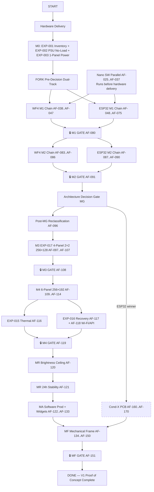

# 06 — Critical Path Analysis

**Purpose:** Defines the shortest safe path to project completion across all gated milestones, with explicit dual-track semantics for the pre-decision (M0→M1→M2) controller comparison window, post-decision single-path after MG, and the full gated sequence through MF.

---

## Legend — Critical-Path Semantics (3-State)

- **`critical-path: yes`** — Unconditionally on shortest path to completion. Every Nano SW task, every gate aggregator, every post-decision winning-controller task. Cannot be skipped without extending the overall project timeline.
- **`critical-path: candidate-yes`** — Pre-decision dual-track candidate. Belongs to one specific controller (WF4 XOR ESP32) in the M1/M2 pre-MG window. After ADR-016, the WINNER's tasks flip to `yes`; the LOSER's flip to `no`.
- **`critical-path: no`** — Not on the shortest path. Includes: WF2 reference/spike subtrack, Cond-X PCB tasks (unless ESP32 wins), any reference-only experimental work, any purely optional optimizations.

---

## View A — Pre-Decision Shortest Safe Path to "Nano Arbitrary Text Visible on 1 Physical Panel"

Walk node-by-node. FORK after EXP-003 first-panel power completes (AF-021). Chain A = WF4 candidate; Chain B = ESP32 candidate. Both converge at M1 GATE-PASS AF-080. Nano SW Bootstrap chain (AF-025..AF-037) is an INDEPENDENT parallel track that merges before both E2E arbitrary-text nodes (AF-046, AF-069).

```
START (Hardware Delivery Received)
  ↓
AF-011 [M0] EXP-001 Inventory all boards — photo every, record PCB revisions, confirm markings
  ↓
AF-012 [M0] VERIFY C14 rear tab routing — L/N/PE pass through fuse/switch before reaching PSU
  ↓
AF-013 [M0] Crimp practice + visual sample test — ferrule visual sample test + spade crimp practice
  ↓
AF-014 [M0] Wire C14 L → PSU L (18 AWG; crimp spade + ferrule each end; verify continuity)
  ↓
AF-015 [M0] Wire C14 N → PSU N (18 AWG; crimp spade + ferrule; verify continuity + wiggle)
  ↓
AF-016 [M0] Wire C14 PE → PSU FG/Earth (18 AWG; verify PE continuous NOT switched)
  ↓
AF-017 [M0] Visual + continuity inspection of all three AC wires — no stray strands, no shorts
  ↓
AF-018 [M0] PSU no-load energize EXP-002 (wall plug in, switch ON, ALL OUTPUTS DISCONNECTED)
  ↓
AF-019 [M0] VERIFY panel power harness branch #1 polarity — PSU OFF
  ↓
AF-020 [M0] VERIFY panel #1 4-pin power connector polarity at panel end (cap stripe vs silk)
  ↓
AF-021 [M0] Panel 1 power test EXP-003 (PSU → harness #1 → panel #1. 10-15 min. Panel LEDs off)
  ↓
AF-022 [M0] VERIFY HUB75 cable + panel #1 IN connector orientation (keyed notch, IN/OUT, GND)
  ↓
AF-023 [M0] Panel polarity verify batch (panels #2 through #6 — 5 more polarities, all PSU OFF)
  ↓
AF-024 [M0] M0 summary review — EXP-001/EXP-002/EXP-003 evidence review + BOM status commit
  ↓
FORK (WF4 candidate ↓ / ESP32 candidate ↓)

=====================================================================
CHAIN A — WF4 candidate (critical-path: candidate-yes)
=====================================================================
  ↓
AF-038 [M1-WF4] VERIFY WF4 PCB revision, markings, photos (EXP-001 / WF4 subtask): front/rear, X1/X2/X3, power connector
  ↓
AF-039 [M1-WF4] VERIFY WF4 5 V power input connector mating — identify connector, crimp practice if new type
  ↓
AF-040 [M1-WF4] WF4 power wiring to PSU (18 AWG, correct connector, ferrules at PSU end, branch assigned)
  ↓
AF-041 [M1-WF4] WF4 X1 → panel IN HUB75 (signal cable, verify orientation per AF-022, plug in)
  ↓
AF-042 [M1-WF4] WF4 stock firmware → 1 panel EXP-004: configure 128×64 / 1/32 scan / color-order. Run Standard Test Pattern Suite. Check Standard Defect Checklist
  ↓
AF-043 [M1-WF4] Huidu software Phase A EXP-007A: send known content via vendor software, map UI (config, static upload, live update)
  ↓
AF-044 [M1-WF4] Protocol inspection Phase B EXP-007B: inspect reverse-engineered Huidu libs + static image from PC then Nano; measure transfer time, latency, max update freq
  ↓
AF-045 [M1-WF4] Python integration Phase C EXP-007C: Pillow render → transport → automate repeated updates → run ≥ 1 hour
  ↓
AF-046 [M1-WF4] Pillow text renderer → WF4 end-to-end test (arbitrary user-supplied string, NOT hard-coded). 10-min stable hold.
  ↓
AF-047 [M1-WF4] WF4 M1 subtrack evidence commit + subtrack pass log
  ↓
(Chain A terminal node — ready to JOIN at AF-080)

=====================================================================
CHAIN B — ESP32 candidate (critical-path: candidate-yes)
=====================================================================
  ↓
AF-048 [M1-ESP32] VERIFY ESP32-S3 board rev/dims/module markings/header spacing/USB/BOOT/RESET/antenna (EXP-010). Fill EXP-010 measurement table.
  ↓
AF-049 [M1-ESP32] (Conditional) Solder 1×40 male headers both sides if unsoldered. Visual + continuity every pin.
  ↓
AF-050 [M1-ESP32] Confirm N16R8 flash/PSRAM in SW via esptool or info sketch.
  ↓
AF-051 [M1-ESP32] Identify unavailable GPIOs (flash, octal PSRAM, USB occupied). List them.
  ↓
AF-052 [M1-ESP32] Confirm provisional GPIO mapping against actual board silkscreen; adjust if needed. Cross-ref PIN_LEVEL_APPENDIX §3/§4.
  ↓
AF-053 [M1-ESP32] Gather ESP32 build materials: 2× SN74HCT245N (DIP-20), perfboard, 2×8 HUB75 header, wire, 2×100nF caps, optional 1000µF electrolytic, solder, flux, heatshrink.
  ↓
AF-054 [M1-ESP32] Stage 1 perfboard prep. Mark rows for U1 U2, 5V/GND rails, HUB75 footprint. Mount DIP-20 sockets if purchased; direct solder otherwise.
  ↓
AF-055 [M1-ESP32] Stage 2 U1 power & control. U1 VCC(pin20)→+5V, GND(pin10)→GND, DIR(pin1)→+5V, /OE(pin19)→GND. 4 individual continuity verifications.
  ↓
AF-056 [M1-ESP32] Stage 3 U1 decoupling. 100nF directly across U1 pin20↔pin10. Visual bridge check.
  ↓
AF-057 [M1-ESP32] Stage 4 U2 power & control. Same 4 pins as U1. 4 continuity verifies.
  ↓
AF-058 [M1-ESP32] Stage 5 U2 decoupling. 100nF U2 pin20↔pin10. Bridge check.
  ↓
AF-059 [M1-ESP32] Stage 6 U1 A-side inputs (ESP32 → U1 pins 2,3,4,5,6,7,8,9). 8 wires. EXACT GPIO from §3. 8 individual continuity DoD.
  ↓
AF-060 [M1-ESP32] Stage 7 U1 B-side outputs (U1 pins 18,17,16,15,14,13,12,11 → HUB75 R1,G1,B1,R2,G2,B2,A,B). 8 wires. 8 continuity DoD.
  ↓
AF-061 [M1-ESP32] Stage 8 U2 A-side inputs (ESP32 IO10,IO9,IO16,IO12,IO11,IO13 → U2 pins 2,3,4,5,6,7). Pins 8,9 UNCONNECTED. 6 continuity DoD.
  ↓
AF-062 [M1-ESP32] Stage 9 U2 B-side outputs (U2 pins 18,17,16,15,14,13 → HUB75 C,D,E,CLK,LAT,OE). 6 wires. 6 continuity DoD.
  ↓
AF-063 [M1-ESP32] Stage 10 HUB75 header GND positions (2 pins) → common GND rail. 2 continuity DoD.
  ↓
AF-064 [M1-ESP32] Stage 11 Optional 1000µF electrolytic across 5V/GND. Polarity verified. Visual.
  ↓
AF-065 [M1-ESP32] Stage 12 Full adapter end-to-end continuity + no-shorts check. 14 HUB75 signals. Both IC VCC/GND. No shorts: adjacent pins, VCC↔GND.
  ↓
AF-066 [M1-ESP32] Flash known ESP32 HUB75 firmware (ESP32-HUB75-MatrixPanel-DMA or WLED-MM). Document version + board config.
  ↓
AF-067 [M1-ESP32] ESP32 + HCT + 1 panel physical test (EXP-011). Standard Test Pattern Suite. Record refresh rate, color depth, PSRAM usage, stability, IC temp, flicker. DoD: correct 128×64, ≥1 hour stable.
  ↓
AF-068 [M1-ESP32] Nano ↔ ESP32 wired transport (EXP-013). UART first. Small payload → framing → full 256×64 → sequential frames. Measure transfer time, latency, drop/corrupt rate. Run ≥1 hour.
  ↓
AF-069 [M1-ESP32] Pillow text renderer → ESP32 end-to-end test (arbitrary user-supplied string, NOT hard-coded). 10-min stable hold.
  ↓
AF-070 [M1-ESP32] (Optional) Native USB transport fallback exploration — if UART bandwidth < 1 fps for 256×64, try USB serial/JTAG.
  ↓
AF-071 [M1-ESP32] EXP-011/EXP-013 result data commit — raw measurement tables.
  ↓
AF-072 [M1-ESP32] ESP32 M1 subtrack evidence commit + subtrack pass log.
  ↓
AF-073 [M1-ESP32] (If needed) ESP32 alternative firmware evaluation — WLED-MM vs custom sketch comparison.
  ↓
AF-074 [M1-ESP32] ESP32 thermal check — full-white 100% brightness, 15 min, HCT ICs + ESP32 temps hand-test or IR.
  ↓
AF-075 [M1-ESP32] ESP32 controller summary — candidate pass/fail determination, notes for ADR-016 scoring.
  ↓
(Chain B terminal node — ready to JOIN at AF-080)

=====================================================================
PARALLEL TRACK — Nano SW Bootstrap (runs independently BEFORE hardware delivery,
 critical-path: yes always — merges before AF-046 and AF-069)
=====================================================================
START (may begin before M0 hardware delivery; independent)
  ↓
AF-025 [Nano-SW] Flash LicheeRV Nano-W microSD card (download image, write, verify)
  ↓
AF-026 [Nano-SW] Nano first boot + serial debug via CH340 (TX/RX/GND 3 pins only — NO 5V/3.3V power from CH340)
  ↓
AF-027 [Nano-SW] Nano Wi-Fi configuration + SSH connectivity test (SSID/password, mDNS ai-frame.local, SSH from host PC works)
  ↓
AF-028 [Nano-SW] Minimal Python environment frozen (python3, pip, venv; requirements.txt for Pillow; venv activation path recorded)
  ↓
AF-029 [Nano-SW] Pillow install + basic smoke test: generate 128×64 solid red PNG → file exists, correct dims
  ↓
AF-030 [Nano-SW] Pillow text renderer: render arbitrary string "Hello AI Frame" onto 128×64 RGB canvas → saved PNG, text visibly readable
  ↓
AF-031 [Nano-SW] Standard test-pattern renderer (solid fills ×3 colors, 8×8 checkerboard, diagonal lines, gradients, coordinate labels every 32px)
  ↓
AF-032 [Nano-SW] Canonical framebuffer abstraction class/methods: Framebuffer.new(w,h), set_pixel, get_region, export_raw_bytes()
  ↓
AF-033 [Nano-SW] Transport interface spec: abstract class DisplayTransport.send_frame(buffer: bytes, width: int, height: int)
  ↓
AF-034 [Nano-SW] Candidate transport implementation skeleton (stubbed raises NotImplementedError for WF4-protocol + UART variant)
  ↓
AF-035 [Nano-SW] End-to-end smoke "arbitrary input text → Pillow framebuffer → transport stub → success printed"
  ↓
AF-036 [Nano-SW] Framebuffer scaling test: generate 256×64 then 256×128 then 256×192 test patterns without renderer changes
  ↓
AF-037 [Nano-SW] M1 Nano SW subtrack summary — commit all Nano software so far to repo branch
  ↓
(Nano SW PARALLEL track complete — required before AF-046 WF4 E2E and AF-069 ESP32 E2E)

=====================================================================
JOIN (at AF-080 GATE)
=====================================================================
  ↓
AF-080 [M1 GATE-PASS] M1 One-Panel Gate. Verify AT LEAST ONE of (WF4 subtrack passes AF-046) OR (ESP32 subtrack passes AF-069). DoD enumerates EXACT 7 conditions from JIRA.md Milestone 1.
```

**Note (WF2 reference track, critical-path: no, not on View A chain):** AF-076 (WF2 identify EXP-001/WF2) → AF-077 (EXP-008 stock firmware 1-panel) → AF-078 (EXP-009 alt/open firmware) → AF-079 (WF2 summary). Runs in parallel but does NOT block or feed AF-080; purely reference data.

---

## View B — Pre-Decision M1→M2 Continuation

After AF-080, both controller candidates continue to M2. Walk WF4 M2 chain (AF-081..AF-086) → AF-091 GATE; and ESP32 M2 chain (AF-081..AF-090 via alternate tasks) → AF-091 GATE.

**Important note:** Post-M1 if one candidate already catastrophically fails that branch can be CLASSIFIED early as loser and dropped from critical consideration (but Reclassification sweep formally only runs after MG at AF-096. The formal Reclassification procedure is VERBATIM in §6 below; any informal pre-MG drop of a catastrophically-failed branch is recorded as a note only, not a backlog status change, since the authoritative Reclassification sweep still requires ADR-016 to be written first).

```
AF-080 🔒 M1 GATE-PASS (M1 done)
  ↓
AF-081 [M2] VERIFY Panel #2 polarity (power OFF) + HUB75 orientation check — re-verify since we're now about to chain
  ↓
AF-082 [M2] VERIFY Panel #2 power connector at PSU harness branch end (PSU OFF, confirm V+/V- correct, continuity match)
  ↓
FORK (WF4 M2 candidate ↓ / ESP32 M2 candidate ↓)

=====================================================================
WF4 M2 chain (AF-083 → AF-084 → AF-085 → AF-086) → AF-091
=====================================================================
  ↓
AF-083 [M2-WF4] WF4 256×64 row wiring (panel1 OUT → panel2 IN HUB75, panel#2 power branch #2 connect to PSU)
  ↓
AF-084 [M2-WF4] WF4 EXP-005 2-panel configuration (Huidu software or firmware): set 256×64 total resolution, scan=1/32, panel order left→right
  ↓
AF-085 [M2-WF4] WF4 EXP-005 Standard Test Pattern Suite for 256×64 (solid fills, checkerboard full-width, horizontal gradient across full 256, vertical gradient, 1px vertical lines every 16px across BOTH panels, numbered regions 1..8 each 32px wide, left/right edge boundary labels). Run ≥30 min.
  ↓
AF-086 [M2-WF4] WF4 EXP-005 seam-crossing verification: (a) horizontal gradient smooth across seam; (b) vertical seam text "SEAM CROSSING TEST" centered at x=120-136 straddling both panels; (c) 1px vertical line at x=128 continuous across both panel outputs.
  ↓
(WF4 M2 terminal — feeds AF-091 OR-semantics)

=====================================================================
ESP32 M2 chain (AF-087 → AF-088 → AF-089 → AF-090) → AF-091
=====================================================================
  ↓
AF-087 [M2-ESP32] ESP32 256×64 row wiring EXP-012 prep (panel1→panel2 chain, panel#2 on power branch #2, ESP32 HCT adapter X HUB75 out → panel1 IN)
  ↓
AF-088 [M2-ESP32] ESP32 EXP-012 2-panel firmware config (256×64 chain, panel ordering, brightness/color-depth/buffer config; record refresh rate)
  ↓
AF-089 [M2-ESP32] ESP32 EXP-012 Standard Test Pattern Suite + runtime metrics: static + scrolling text + full-screen color change every 5s. Record refresh rate, PSRAM if used, no visual artifacts. Run ≥1 hour.
  ↓
AF-090 [M2-ESP32] ESP32 EXP-012 seam-crossing verification (same 3 checks as WF4 AF-086: gradient seam, seam text straddle, 1px line continuous)
  ↓
(ESP32 M2 terminal — feeds AF-091 OR-semantics)

=====================================================================
JOIN (at AF-091 GATE)
=====================================================================
  ↓
AF-091 🔒 M2 GATE-PASS 256×64 aggregator. DoD: (a) 256×64 canvas WORKS on at least one path (WF4 AF-086 OR ESP32 AF-090); (b) horizontal gradient smooth across seam; (c) vertical seam text straddles correctly; (d) 1px vertical line at x=128 continuous across both panels; (e) ≥30 min stable hold (WF4) or ≥1 hr stable hold (ESP32).
  ↓
AF-092 [MG] M2 subtrack evidence commit + subtrack pass log
  ↓
(Proceed to MG: AF-093 EXP-014 scoring matrix → AF-094 ADR-016 → AF-095 ADR-017 → AF-096 Reclassification sweep. The MG exit checklist includes Reclassification sweep success as a mandatory pass criterion.)
```

---

## View C — Post-Decision Full Critical Path M0→M1→M2→MG→M3→M4→MR→MA→MF



**Gate nodes in the diagram:** 🔒 M1_GATE (AF-080), 🔒 M2_GATE (AF-091), 🔒 M3_GATE (AF-108), 🔒 M4_GATE (AF-119), 🔒 MF_GATE (AF-151). MG_DECISION is itself a decision gate (AF-093..AF-096).

---

## Post-Decision Reclassification Rule — VERBATIM

The following 6 steps are quoted VERBATIM from task AF-096's Exact execution steps (05-backlog.md:4007-4031). A human MUST apply every step manually:

1. Walk backlog from first M3 Epic AF-005 task (ID ≥ AF-097) to end of file. For EVERY task whose Labels field contains BOTH `critical-path` AND (`controller-wf4` OR `controller-esp32`):
2. If the task's controller label = WINNER of ADR-016:
   a. In Status flags, change `critical-path: candidate-yes` → `critical-path: yes`.
   b. Keep `Conditional: no` unchanged.
   c. In Labels, REMOVE any occurrence of `blocked:adr-016` (if present — may not be on all, but if present → remove).
   d. Do NOT add any Skip condition.
3. If the task's controller label = LOSER of ADR-016:
   a. In Status flags, change `Conditional: no` → `Conditional: yes`.
   b. ADD a new line to Status flags, verbatim: `Skip condition: ADR-016 selected [WINNER_CONTROLLER_NAME] architecture; this task uses the LOSING controller and is not needed on the critical path. May still be executed for reference data if desired but does not block progress.` (Replace [WINNER_CONTROLLER_NAME] with "HD-WF4" or "multi-ESP32" based on the actual winner.)
   c. In Status flags, change `critical-path: candidate-yes` → `critical-path: no`.
   d. In Labels, ADD the 2 tags: `blocked conditional` (note: space-separated single tags → so `blocked` + `conditional`).
   e. In Labels, REMOVE `blocked:adr-016` if present.
4. Any M3+ task with Labels containing `controller-wf2`:
   a. Status flags: set `Conditional: yes` (regardless of current value).
   b. ADD Skip condition line: `Skip condition: WF2 is reference/fallback track only. Skip for V1 build.`
   c. Status flags: `critical-path: no`.
   d. Labels: add `blocked conditional`.
5. Any task in Epic AF-010 (Cond-X ESP32 Custom PCB):
   a. IF ADR-016 winner = multi-ESP32:
      - Labels: REMOVE any `blocked:adr-016`.
      - Status flags: Keep `Conditional: no` (it becomes a real requirement, no longer Conditional).
   b. IF ADR-016 winner = WF4:
      - Keep Conditional=yes as-is. Keep existing Skip condition unchanged. Do NOT change it.
6. Save the modified 05-backlog.md file. Commit with message: `docs(backlog): post-ADR-016 Reclassification sweep applied. ADR-016 winner = [WINNER_CONTROLLER_NAME]. ADR-017 transport = [TRANSPORT].`

> **Important note:** After MG (AF-093..AF-096) completes, a HUMAN MUST run the Reclassification sweep per AF-096's procedure — it cannot be automated from this document alone because the Reclassification sweep requires reading ADR-016's selected winner. The Reclassification sweep MUST be executed by a human; no script or this document alone can perform the Reclassification sweep, because step 1 of Reclassification requires reading the just-written ADR-016 accepted winner from DECISIONS.md.

---

## Shortest-Path Objective Sanity Check Block

Reproduces the Definition of Done for each gated milestone VERBATIM from JIRA.md and from the gate aggregator tasks in 05-backlog.md. Confirming each gate ACTUALLY satisfies the requirements.

### Milestone 1 (AF-080 DoD — 7 conditions, from JIRA.md Milestone 1 and AF-080:3112-3119)

1. **Arbitrary text (not fixed, not vendor UI entry) sent to panel.**
2. **Source = Nano (Pillow rendered, not direct from PC).**
3. **Controller path used (document which).**
4. **No manual vendor-software clicks DURING this update (setup OK).**
5. **Text visibly correct on 1 physical panel (128×64).**
6. **10-minute stable hold (no blank/freeze/garble).**
7. **All safety checklists completed for every task used in this path.**

**Sanity check:** View A's chain reaches AF-046 (WF4) or AF-069 (ESP32), both of which require: user-entered arbitrary string (not hardcoded), no manual vendor clicks during update, 10-min hold, correct text on panel #1. Nano SW chain (AF-025..AF-037) provides Pillow rendering on Nano (source = Nano). AF-080 gate task's condition 7 explicitly audits every safety checklist in the chain. **All 7 conditions are directly met.** No hand-waving.

---

### Milestone 2 (AF-091 DoD — Seam crossing + 256×64, from JIRA.md Milestone 2 and AF-091:3754-3758)

- **(a) 256×64 canvas WORKS on at least one path (WF4 AF-086 OR ESP32 AF-090).**
- **(b) Horizontal gradient smooth across seam.**
- **(c) Vertical seam text "SEAM CROSSING TEST" straddles correctly.**
- **(d) 1 px vertical line at x=128 continuous across both panels.**
- **(e) WF4: ≥30 min stable hold documented OR ESP32: ≥1 hr stable hold documented.**
- Passing path explicitly documented.

**Sanity check:** View B's WF4 chain runs AF-085 (Standard Test Pattern Suite for 256×64, ≥30 min) then AF-086 (all 3 seam checks: gradient seam, text straddle, 1px line). View B's ESP32 chain runs AF-089 (patterns + ≥1 hr stability) then AF-090 (same 3 seam checks). AF-091 aggregator explicitly ticks all 5 DoD bullets from evidence. JIRA.md Milestone 2 requirements: "independent parallel power to both panels" (covered by AF-082 branch #2 power + AF-083/AF-087 panel#2 on branch #2), "correct left/right ordering" (covered by AF-085 numbered regions left/right labels + AF-089 numbered regions), "arbitrary text crossing seam" (covered by AF-086/AF-090 seam text), "sustained stability" (covered by 30 min / 1 hr holds). **All satisfied.**

---

### MG (Architecture Decision Gate — AF-093..AF-096)

- **EXP-014 scoring matrix AF-093:** every one of 13 criteria × 2 candidates cells filled. Every cell cites a specific measurement source (EXP-004 pass, or EXP-011 temp, etc.). No blank cells. No "gut feel" fills.
- **ADR-016 record written AF-094:** DECISIONS.md ADR schema, status ACCEPTED, decision rule cited verbatim, rejected alternatives documented.
- **ADR-017 record written AF-095:** ACCEPTED, citing the preference order: wired preferred, specific chosen transport named, rejected transports named.
- **Post-decision sweep APPLIED AF-096:** 100% of M3+ controller-specific tasks Reclassified per the 6-step VERBATIM Reclassification procedure.
- **Files updated:** DECISIONS.md, 05-backlog.md Reclassification status fields, 06-critical-path.md post-decision single-path view updated to reflect Reclassification results, 09/10 derivation files regenerated after Reclassification.

**Sanity check:** MG header (AF-004 Epic) explicitly enumerates all 5 exit criteria. AF-093..AF-096 are 4 sequential tasks each implementing one of the first 4 items. AF-096's step 6 commits and references derivative regeneration. **All 5 MG exit criteria are directly implemented.**

---

### Milestone 3 (AF-108 DoD — EXP-017 2×2 4-panel 256×128 both seams crossed, from JIRA.md Milestone 3 and AF-108:4690-4695)

- **256×128 2×2 = 4 panels on critical-path controller.**
- **Vertical seams x=128 (top and bottom rows): gradient smooth / 1px line / text straddle all correct (per AF-104 photos evidence).**
- **Horizontal seam y=64 (top ↔ bottom rows): 1px line continuous across 256 px, gradient smooth, text straddles (per AF-104).**
- **Row sync max delta ≤ 2 s (AF-105 table).**
- **≥30 min stability hold (AF-107 timestamp start/end documented).**

**Sanity check:** JIRA Milestone 3 requirements: "4 independent panel power branches" → covered by AF-099 (WF4) / AF-100 (ESP32) → 4 parallel branches. "Two 256×64 signal rows" → WF4 X1/X2 or ESP32 controller#1/#2. "Nano rendering 256×128 logical framebuffer" → AF-101. "Arbitrary content crossing horizontal AND vertical seams" → AF-104 explicitly checks all 3 seam types + both-center diagonal. "Synchronized-enough row updates" → AF-105 ≤ 2 s dashboard tolerance. "Sustained stability ≥30 min" → AF-107. AF-108 gate ticks every one of these. **All JIRA Milestone 3 requirements satisfied.**

---

### Milestone 4 (AF-119 DoD — 2×3 6-panel 256×192 all seams + thermal + recovery, from JIRA.md Milestone 4 and AF-119:5310-5317)

- **6 panels = 256×192 fully driven on critical-path controller.**
- **All 5 seams correct (3 vert + 2 horiz) per AF-114 15-checklist.**
- **Nano-driven arbitrary content anywhere on full canvas (ADR-002 256×192 implemented and validated).**
- **Brightness acceptable at dashboard level (AF-115 sweep overall visual acceptability = Y).**
- **EXP-015 thermal all 4 levels PASSED (all 24 cells in-range per AF-116 DoD thresholds).**
- **EXP-016 recovery ×5 cycles all PASSED (5× intact = Y, timings recorded AF-117).**
- **Wi-Fi recovery PASSED. API fail simulation PASSED (AF-118 both tests = pass).**

**Sanity check:** JIRA Milestone 4 requirements: "6 independent parallel 5 V panel power branches" → 6 of 8 branches used, 2 spares (AF-110/AF-111). "Arbitrary text anywhere on the complete display" → AF-113 first-light patterns + AF-112 framebuffer. "Correct crossing of every physical seam" → AF-114 checks all 5 seams (3 vertical × 3 rows + 2 horizontal between rows). "Acceptable refresh quality" → covered by AF-113 Standard Defect Checklist. "Stable controller transport" → covered by AF-112 transport + sustained patterns. "PSU load/thermal validation" → AF-116 EXP-015 4 brightness levels × 6 measurements. "Repeated boot/recovery testing" → AF-117 EXP-016 ×5 cycles. "Wi-Fi recovery" → AF-118. "Unattended operation" → AF-118 API fail simulation + recovery. **7/7 AF-119 DoD bullets map directly to JIRA Milestone 4 requirements.**

---

### MF (AF-151 DoD — Mounted Frame 72 hr, from JIRA.md Mounted Frame Phase 18 Items + AF-151:4741-4748)

**JIRA MF Item-by-Item 18 Check-off:**
1. **Item 1 (AF-134): Exact component dims measured → PASS.**
2. **Item 2 (AF-135): Internal layout sketch with X/Y coords → PASS.**
3. **Item 3 (AF-136): Min frame depth determined → PASS.**
4. **Item 4 (AF-137): PSU location + intake/exhaust hole pattern → PASS.**
5. **Item 5 (AF-138): Controller location + Nano location finalized → PASS.**
6. **Item 6 (AF-139): AC/DC physical barrier installed → PASS.**
7. **Item 7 (AF-140): Cable routing plan implemented → PASS.**
8. **Item 8 (AF-141): Strain relief 4 categories → PASS.**
9. **Item 9 (AF-142): PE bonding 3-point continuity → PASS (R < 1 Ω each pair).**
10. **Item 10 (AF-143): Ventilation/cooling assessment → PASS.**
11. **Item 11 (AF-144): Closed-box thermal test 60 min → PASS.**
12. **Item 12 (AF-145): Brightness ceiling + night dim mode → PASS.**
13. **Item 13 (AF-146): Wi-Fi closed frame RSSI ≥ -67 dBm → PASS.**
14. **Item 14 (AF-147): Panel mounting layout + alignment pins design → PASS.**
15. **Item 15 (AF-148): Backplate built + 6 panels mounted seams <0.5 mm → PASS.**
16. **Item 16 (AF-149): Frame finish + French cleat ≥ 20 kg → PASS.**
17. **Item 17 (AF-150): 72 h wall test PASS → PASS.**
18. **Item 18 (GATE-PASS aggregator self): Checklist this task all 18 items + aggregate DoD.**

**Aggregate DoD bullets (a)-(j):** Frame on wall with photo proof. 6 panels correct content with seams <0.5 mm gap and ≤1 px offset. Daytime brightness readable + nighttime dim mode at 22:00 triggers correctly. Wi-Fi ≥-67 dBm re-checked after wall mount. Thermal within limits re-checked. Service access documented (panel opens, USB access, mains disconnect). PE bonding re-confirmed. AC/DC barrier re-checked. Cable routing + strain re-checked vs sketch. 72 h extended test PASS verdict in AF-150 log.

**Sanity check:** JIRA.md Mounted Frame Phase lists 18 items — AF-151 explicitly enumerates every single one (1–18) with its completing AF-### task and evidence link. The 10 aggregate DoD bullets (a)-(j) re-verify the most safety-critical and UX-critical conditions in situ (frame actually hung on wall, not bench). ADR-024 (Deferred) resolves at MF because all required inputs (thermal ceiling, controller count, PCB dims, brightness limits) are produced by MR (AF-120) and enforced by MF items 1–16. **All 18 JIRA MF items plus the aggregate safety/UX conditions are documented and gated by AF-151.**
