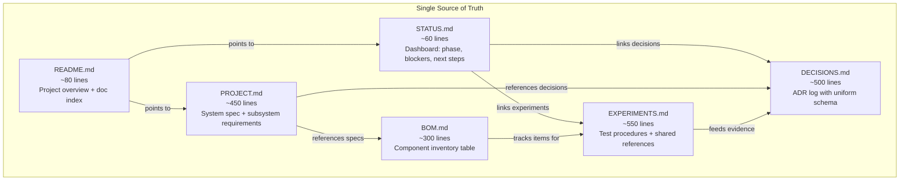

# Documentation Restructure Implementation Plan

> **For agentic workers:** REQUIRED SUB-SKILL: Use superpowers:subagent-driven-development to implement this plan task-by-task. Steps use checkbox (`- [ ]`) syntax for tracking.

**Goal:** Restructure 6 markdown files from 5,118 lines / 111 KB to ~1,940 lines / ~45 KB with zero information loss, enforcing single-source-of-truth ownership per file.

**Architecture:** Each file owns exactly one domain. Duplicated content is deleted (not moved — it already exists in its canonical home). Unique misplaced content is relocated before deletion. The restructuring proceeds file-by-file in dependency order: STATUS → BOM → PROJECT → DECISIONS → EXPERIMENTS → README.



**Tech Stack:** Markdown, Git, shell commands for verification (line counts, grep for orphaned references)

## Global Constraints

- **Zero information loss**: Every unique fact identified in the cross-reference audit must survive in exactly one canonical file.
- **No cross-file duplication**: Each specification, component detail, decision rationale, or test procedure appears in exactly one file. Other files reference it by name/ID, never restate it.
- **Preserve all existing comments and docstrings unrelated to the restructure** (per project guidelines).
- **Keep markdown well-formed**: All code fences balanced, all internal links valid, all tables parseable.
- **One commit per task**: Each task produces a single atomic commit on the `docs/restructure` branch.
- **Target line counts** (±15%): STATUS ~60, BOM ~300, PROJECT ~450, DECISIONS ~500, EXPERIMENTS ~550, README ~80.
- **Unique misplaced content**: STATUS.md's PatternFlow and Seengreat reference design citations must be relocated to BOM.md (component reference designs) before STATUS is stripped.

---

### Task 1: Restructure STATUS.md (~371 → ~60 lines)

**Files:**
- Modify: [`docs/STATUS.md`](file:///Users/jon.robbins/GitHub/ai-frame/docs/STATUS.md)
- Modify: [`docs/BOM.md`](file:///Users/jon.robbins/GitHub/ai-frame/docs/BOM.md) (relocate unique PatternFlow/Seengreat citations)

**Interfaces:**
- Consumes: Nothing (first task)
- Produces: Clean STATUS.md that later tasks can link to; PatternFlow/Seengreat citations preserved in BOM.md

**Unique content to preserve (relocate to BOM.md before stripping):**
- PatternFlow: physical/pinout reference design for ESP32-S3 N16R8 board
- Seengreat RGB Matrix Adapter V3.9: electrical buffering reference design for SN74HCT245N interface

**Unique content to keep in STATUS.md:**
- Document date stamp (18 August 2026)
- Staged product milestones (Milestone 1 & 2)
- 13-stage project lifecycle pipeline (but compress to a compact list, not 40-line ASCII art)
- Blocker categorization (external: shipping; technical: none)

**Content to DELETE (exists in canonical homes):**
- 26-item purchasing list (→ canonical in BOM.md)
- 67-line architecture candidate diagrams (→ canonical in PROJECT.md)
- 75-line test procedures / bring-up steps (→ canonical in EXPERIMENTS.md)
- Decision summaries / deferred decisions list (→ canonical in DECISIONS.md)
- Blockquoted central question (→ canonical in EXPERIMENTS.md/DECISIONS.md)
- Open architectural questions (→ canonical in PROJECT.md/EXPERIMENTS.md)
- ESP32-HUB75 research notes (→ canonical in BOM.md)

**Target structure:**
```markdown
# AI Frame — Project Status

**Last updated:** 18 August 2026
**Current phase:** Prototype hardware acquisition and architecture validation

## Current State
[2-3 sentences: hardware ordered, waiting for delivery, then controller validation begins]

## Active Blockers
- **External:** [shipping status]
- **Technical:** [none / specific blocker]

## Milestones
| # | Milestone | Status |
|---|-----------|--------|
| 1 | Display one programmatic image on one P2 panel via candidate controller | NOT STARTED |
| 2 | Drive full 256×192 six-panel display from Nano via selected controller | NOT STARTED |

## Next Actions (On Hardware Arrival)
1. Hardware inspection and inventory → [EXP-001](EXPERIMENTS.md)
2. ESP32 physical measurement → [EXP-010](EXPERIMENTS.md)
3. PSU no-load bring-up → [EXP-002](EXPERIMENTS.md)
4. Single-panel power test → [EXP-003](EXPERIMENTS.md)
5. Controller candidate experiments → [EXP-004](EXPERIMENTS.md) through [EXP-014](EXPERIMENTS.md)

## Project Lifecycle
1. ~~Product definition~~ ✓
2. ~~High-level architecture~~ ✓
3. ~~Prototype parts selection~~ ✓
4. ~~Parts ordered~~ ✓
5. **Hardware delivery** ← CURRENT
6. Electrical bring-up
7. Controller experiments
8. Architecture selection → [ADR-016](DECISIONS.md)
9. Custom PCB (if ESP32 path) → [ADR-018](DECISIONS.md)
10. Software integration
11. Full six-panel prototype
12. Frame / enclosure → [ADR-024](DECISIONS.md)
13. V1

## Related Documentation
- [PROJECT.md](PROJECT.md) — System specification and architecture
- [BOM.md](BOM.md) — Component inventory and procurement status
- [DECISIONS.md](DECISIONS.md) — Architecture decision records
- [EXPERIMENTS.md](EXPERIMENTS.md) — Validation test procedures and results
```

- [ ] **Step 1: Add PatternFlow and Seengreat reference citations to BOM.md**

  In `docs/BOM.md`, locate the ESP32-S3 section and the SN74HCT245N section. Add one-line reference design citations to each:
  - ESP32-S3 section: `Reference design: PatternFlow (physical layout and pinout reference)`
  - SN74HCT245N section: `Reference design: Seengreat RGB Matrix Adapter V3.9 (electrical buffering reference)`

- [ ] **Step 2: Rewrite STATUS.md**

  Replace the entire contents of `docs/STATUS.md` with the target structure above, filled in with the preserved unique content. Ensure all cross-references to other docs use relative links.

- [ ] **Step 3: Verify**

  ```bash
  wc -l docs/STATUS.md  # Target: 50-70 lines
  grep -c '\[.*\](.*\.md)' docs/STATUS.md  # Should find cross-reference links
  grep -c 'PatternFlow\|Seengreat' docs/BOM.md  # Should find 2 citations
  ```

- [ ] **Step 4: Commit**

  ```bash
  git add docs/STATUS.md docs/BOM.md
  git commit -m "docs: restructure STATUS.md to focused dashboard, relocate reference design citations to BOM.md"
  ```

---

### Task 2: Restructure BOM.md (~1,093 → ~300 lines)

**Files:**
- Modify: [`docs/BOM.md`](file:///Users/jon.robbins/GitHub/ai-frame/docs/BOM.md)

**Interfaces:**
- Consumes: PatternFlow/Seengreat citations added in Task 1
- Produces: Clean BOM.md with master component table; referenced by PROJECT.md and EXPERIMENTS.md

**Unique content to KEEP (exists only in BOM.md):**
- ALL Chinese part names and e-commerce search terms (every single one)
- ALL exact purchase prices in RMB ¥
- ALL specific brands, manufacturers, and model numbers
- ALL component packaging specs and wire gauge details
- PCB fabrication service names (嘉立创/JLCPCB, 捷配/Jiepei, 捷多邦/JDBPCB) and specs
- Electrical safety warnings (multimeter current shunt, CH340 backpower)
- Shipment receipt 10-point inspection checklist (keep, but compress)
- BOM lifecycle rules (ORDERED → RECEIVED → TESTED → FINAL promotion)
- PatternFlow and Seengreat reference citations (added in Task 1)

**Content to DELETE:**
- Architecture trade-off analysis / outcome diagrams (Section 14 → canonical in DECISIONS.md)
- Power budget calculations/proofs (Section 15 → already in PROJECT.md)
- Cable routing and topology diagrams (Section 16 → canonical in PROJECT.md)
- Beginner tutorials (AC wiring colors, bypass cap placement, UART crossover)
- Redundant power calculations (stated 4 times internally)
- Duplicate signal topology diagrams (body vs Section 16)
- BOM maintenance governance rules beyond the lifecycle definitions

**Content to RESTRUCTURE:**
- Convert ~30 components from inconsistent bullet lists into a single master table
- Standardize status enum: use only the 7 defined values (ALREADY OWNED, ORDERED, RECEIVED, TESTED, FINAL, OPTIONAL, REJECTED). Eliminate `DEFERRED`, `NOT SELECTED`, `VERIFY ON RECEIPT`.
- Group by category: Core Display, Application Computer, Controller Candidates, ESP32 Prototype Components, Power Infrastructure, Wiring & Connectors, Development Tools, Consumables, Deferred/Future Items

**Target structure:**
```markdown
# AI Frame — Bill of Materials

**Last updated:** 18 August 2026

## Status Values
ALREADY OWNED | ORDERED | RECEIVED | TESTED | FINAL | OPTIONAL | REJECTED

## Component Inventory

### Core Display Hardware
| Item (EN) | Item (ZH) | Model / Spec | Qty | Unit ¥ | Status | Notes |
|-----------|-----------|-------------|-----|--------|--------|-------|
| P2 LED Panel | P2室内全彩LED显示屏模组 | 128×64, HUB75E, 1/32, 5V/23W, SMD1515 | 6 | — | ALREADY OWNED | Seller ref: P2-32S |

### Application Computer
[same table format]

### Controller Candidates
[same table format, including reference design citations]

### ESP32 Prototype Components
[same table format]

### Power Infrastructure
[same table format]

### Wiring & Connectors
[same table format]

### Development & Debugging Tools
[same table format]

### Consumables
[same table format]

### Deferred / Future Items
[Custom PCB, with fab specs and service names]

## Safety Notes
- Do not measure full display current in series (27.6A max exceeds typical multimeter 10A shunt).
- Do not connect CH340 5V output to a board already receiving external 5V power.

## Receipt Inspection Checklist
[Compressed to ~10 numbered items]

## Lifecycle Rules
- ORDERED → RECEIVED on physical delivery and inspection.
- RECEIVED → TESTED after relevant experiment in [EXPERIMENTS.md](EXPERIMENTS.md) passes.
- TESTED → FINAL after architecture decision in [DECISIONS.md](DECISIONS.md) is ACCEPTED.
- Components not selected for V1 are marked REJECTED with rationale.
```

- [ ] **Step 1: Read the full current BOM.md and extract all unique data points**

  Read the entire file. For every component, extract: English name, Chinese name, model/spec, quantity, price, status, and any unique notes. Create a working inventory list.

- [ ] **Step 2: Rewrite BOM.md with master table structure**

  Replace the entire contents with the target structure, populated with all extracted data. Ensure every Chinese name, every price, every spec, and every unique note is preserved. Compress the receipt checklist to ~10 concise items. Keep safety notes. Keep lifecycle rules.

- [ ] **Step 3: Verify zero information loss**

  ```bash
  # Check all Chinese terms survived
  grep -cP '[\x{4e00}-\x{9fff}]' docs/BOM.md  # Should be significant (30+ lines with Chinese)
  # Check all prices survived
  grep -c '¥' docs/BOM.md  # Should find 15+ price entries
  # Check line count
  wc -l docs/BOM.md  # Target: 250-350 lines
  # Check reference designs survived
  grep -c 'PatternFlow\|Seengreat' docs/BOM.md  # Should find 2
  ```

- [ ] **Step 4: Commit**

  ```bash
  git add docs/BOM.md
  git commit -m "docs: restructure BOM.md into master component table, remove tutorials and architecture analysis"
  ```

---

### Task 3: Restructure PROJECT.md (~1,111 → ~450 lines)

**Files:**
- Modify: [`docs/PROJECT.md`](file:///Users/jon.robbins/GitHub/ai-frame/docs/PROJECT.md)

**Interfaces:**
- Consumes: Clean BOM.md (Task 2) for cross-references
- Produces: Clean system specification; referenced by all other docs

**Unique content to KEEP (exists only in PROJECT.md):**
- HUB75 real-time signal breakdown (R1/G1/B1, R2/G2/B2, A/B/C/D/E, CLK, LAT, OE) — but compress from 65 lines to ~10 lines of key constraints
- Multi-ESP32 row cropping coordinates (crop y=0..63, y=64..127, y=128..191)
- Boot and runtime sequence flowchart — compress to a compact list
- Offline UI state specification (cached data, fallback screen)
- Supported OS distribution classes (Linux/Buildroot/Debian for SG2002)
- Failure/recovery/supervision requirements (systemd, independent restart, health indicator)
- Software transport decoupling specifics (renderer agnostic to physical transport)

**Content to DELETE:**
- Display specs repeated 5 times internally → state once in Display Subsystem section
- Core decoupling principle repeated 8 times → state once in Architecture section
- Power distribution rule repeated 5 times → state once in Power Subsystem section
- 4 near-duplicate system block diagrams → keep ONE unified diagram
- Sections 12-13 (architectural unknowns + established decisions) → canonical in DECISIONS.md and EXPERIMENTS.md
- Component pricing and part numbers → canonical in BOM.md
- V1 non-goals that duplicate DECISIONS.md rejected ADRs → keep brief list, reference DECISIONS.md

**Target structure:**
```markdown
# AI Frame — Project Specification

## 1. Product Definition
### 1.1 Purpose
[2-3 sentences: ambient wall-mounted info display, glanceable, no interaction required]

### 1.2 Functionality (V1)
[Bullet list: time, weather, calendar, Spotify, artwork, dashboards, API-driven content]

### 1.3 Product Principles
[Compact list: thin, quiet, Wi-Fi, Python-friendly, commodity hardware, open, reliable, repairable, no cloud lock-in]

### 1.4 V1 Scope Boundaries
[Brief list of non-goals with ADR references]

---

## 2. System Architecture
[ONE unified block diagram: Internet → Nano-W → Transport → Controller → HUB75 → Panels]

### 2.1 Core Decoupling Contract
[3-4 sentences stated ONCE]

---

## 3. Subsystem Specifications

### 3.1 Display Subsystem
[ALL display specs stated exactly once. HUB75 interface constraints compressed to ~10 lines]

### 3.2 Compute Subsystem
[Nano-W specs by reference to BOM.md, OS options, 256MB RAM constraint]

### 3.3 Display Controller Subsystem
[Candidates with topology diagrams, multi-ESP32 crop coordinates, references to ADR-010..016]

### 3.4 Power Subsystem
[AC input, PSU, parallel DC distribution stated ONCE, power budget summary, reference BOM.md]

### 3.5 Enclosure & Mechanical
[Wall mount, depth constraint, ventilation, reference ADR-024]

---

## 4. Software Architecture
### 4.1 Application Pipeline
### 4.2 Transport Abstraction
### 4.3 Fault Tolerance
### 4.4 Boot Sequence

---

## 5. Document Map
[Cross-references to BOM.md, DECISIONS.md, EXPERIMENTS.md, STATUS.md]
```

- [ ] **Step 1: Read the full current PROJECT.md and catalog all unique content**

  Read the entire 1,111-line file. Identify every passage that contains unique information (per the cross-reference map). Note the line ranges.

- [ ] **Step 2: Rewrite PROJECT.md with subsystem-organized structure**

  Replace the entire contents with the target structure, populated with all unique content. State each specification exactly once. Use ONE system architecture diagram. Compress the HUB75 tutorial to key constraints only. Replace Sections 12-13 with cross-references.

- [ ] **Step 3: Verify**

  ```bash
  wc -l docs/PROJECT.md  # Target: 380-520 lines
  # Verify unique content survived
  grep -c 'crop y=' docs/PROJECT.md  # Multi-ESP32 coordinates
  grep -c 'CLK\|LAT\|OE' docs/PROJECT.md  # HUB75 signals
  grep -c 'offline\|cached\|fallback' docs/PROJECT.md  # Offline UI spec
  grep -c 'systemd\|supervisor\|health' docs/PROJECT.md  # Supervision requirements
  grep -c 'Buildroot\|Debian' docs/PROJECT.md  # OS options
  ```

- [ ] **Step 4: Commit**

  ```bash
  git add docs/PROJECT.md
  git commit -m "docs: restructure PROJECT.md around subsystems, eliminate internal duplication"
  ```

---

### Task 4: Restructure DECISIONS.md (~1,092 → ~500 lines)

**Files:**
- Modify: [`docs/DECISIONS.md`](file:///Users/jon.robbins/GitHub/ai-frame/docs/DECISIONS.md)

**Interfaces:**
- Consumes: Clean PROJECT.md (Task 3) for cross-references
- Produces: Streamlined ADR log; referenced by PROJECT.md, EXPERIMENTS.md, STATUS.md

**Unique content to KEEP:**
- All 24 ADR decisions and their core rationale (but consolidate mirror pairs)
- 74HCT vs 74HC electrical input margin rationale
- Software blacklist for Nano-W (Chromium, Jupyter, pandas, local ML)
- Rejection of cascade architecture (Nano→ESP32→WF4→panel)
- Core decision-making philosophy/rule
- Pending decision flow (compress to compact form)

**Structural changes:**
1. **Merge mirror ADR pairs** (keep the positive framing, fold negative into Rejected Alternatives):
   - ADR-003 + ADR-020 → merged ADR-003 (separate compute from HUB75; rejected: direct Linux GPIO)
   - ADR-002 + ADR-023 → merged ADR-002 (canonical framebuffer + transport abstraction)
   - ADR-004 + ADR-005 + ADR-019 → merged ADR-004 (Linux/Python on Nano-W; rejected: Raspberry Pi)
   - ADR-013 + ADR-015 + ADR-018 → merged ADR-013 (ESP32 evaluation & adapter PCB strategy)
2. **Delete Section 3** ("Rejected Approaches" — 85 lines of pure duplication): inline into parent ADRs
3. **Move Section 4** (Decision-Making Principle) to the top as the preamble
4. **Move Section 5** (Pending Decision Flow) to a compact subsection, or reference STATUS.md
5. **Standardize ADR schema** — every entry gets: `Status | Context | Decision | Rationale | Consequences | Rejected Alternatives`
6. **Remove trivial code blocks** wrapping plain values like `256 × 192` or `5 V / 40 A`

**Post-merge ADR count:** ~15 ADRs (down from 24)

**Target structure:**
```markdown
# AI Frame — Architecture Decision Log

## Decision-Making Principle
[The philosophy block — currently buried at bottom, moved to top]

## Status Values
PROPOSED | ACCEPTED | PENDING | SUPERSEDED | REJECTED | DEFERRED

## Decision Index
| ID | Decision | Status |
|----|----------|--------|
[Updated index with ~15 merged ADRs]

---

## ADR-001 — Six P2 HUB75E Panels in 2×3 Layout
**Status:** ACCEPTED
**Context:** [1-2 sentences]
**Decision:** [1-2 sentences]
**Rationale:** [2-3 sentences]
**Consequences:** [bullet list]

## ADR-002 — Canonical 256×192 Framebuffer with Transport Abstraction
[Merged ADR-002 + ADR-023]
**Status:** ACCEPTED
**Rejected Alternatives:** Direct controller-coupled rendering

[...etc for each ADR, following uniform schema...]
```

- [ ] **Step 1: Read the full current DECISIONS.md and map all ADRs**

  Read the entire file. For each of the 24 ADRs, extract: ID, title, status, core decision, rationale, and any unique content. Identify the mirror pairs and duplication.

- [ ] **Step 2: Rewrite DECISIONS.md with merged ADRs and uniform schema**

  Replace the entire contents. Move the decision-making philosophy to the top. Merge the identified mirror pairs. Delete Section 3. Standardize every ADR on the uniform schema. Remove trivial code blocks.

- [ ] **Step 3: Verify**

  ```bash
  wc -l docs/DECISIONS.md  # Target: 425-575 lines
  # Verify unique content survived
  grep -c 'HCT\|74HC' docs/DECISIONS.md  # HCT vs HC rationale
  grep -c 'Chromium\|Jupyter\|pandas' docs/DECISIONS.md  # Software blacklist
  grep -c 'cascade' docs/DECISIONS.md  # Cascade rejection
  grep -c 'simplest architecture' docs/DECISIONS.md  # Decision philosophy
  # Verify no Section 3 remnant
  grep -c 'Rejected / Avoided Approaches' docs/DECISIONS.md  # Should be 0
  ```

- [ ] **Step 4: Commit**

  ```bash
  git add docs/DECISIONS.md
  git commit -m "docs: consolidate 24 ADRs to ~15, standardize schema, eliminate mirror duplicates"
  ```

---

### Task 5: Restructure EXPERIMENTS.md (~1,326 → ~550 lines)

**Files:**
- Modify: [`docs/EXPERIMENTS.md`](file:///Users/jon.robbins/GitHub/ai-frame/docs/EXPERIMENTS.md)

**Interfaces:**
- Consumes: Clean DECISIONS.md (Task 4) for cross-references
- Produces: Clean experiment log; referenced by STATUS.md and DECISIONS.md

**Unique content to KEEP:**
- All 16 experiment plans (EXP-001 through EXP-016) with their procedures and success criteria
- Test pattern suite and defect observation checklist (define ONCE as shared reference)
- EXP-007 three-phase test procedure (vendor GUI, protocol reverse-engineering, Python pipeline)
- EXP-013 packet framing protocol specification and bandwidth math
- EXP-014 thirteen-criteria controller scoring matrix
- EXP-015 brightness/thermal test matrix
- EXP-016 appliance boot/recovery procedure
- Catalog of 18 planned future experiments
- Experiment record template

**Content to DELETE:**
- Section 1 "Experimental Principles" tutorial (26 lines → 3 lines max)
- 112 lines of empty `Result: TBD / Conclusion: TBD` stubs
- Section 22 meta-documentation explanation (38 lines → 2-line cross-reference)
- Duplicate test pattern lists (repeated across 6 experiments → define once, reference)
- Duplicate defect observation checklists (repeated across 3 experiments → define once)
- Duplicate parallel power wiring diagrams (in EXP-005 and EXP-012 → reference PROJECT.md)
- Editorial commentary ("This is one of the most important experiments...")
- Over-explained safety preambles (compress to `> [!WARNING]` callouts)
- Verbose ASCII art for simple linear chains (15-line box → 1-line inline flow)

**Structural changes:**
1. Fix heading hierarchy: `## EXP-001` (not `# 4. EXP-001`)
2. Add structured frontmatter: `Status | Depends-On | Hardware | Success Criteria`
3. Create shared reference sections at the top (test patterns, defect checklist)
4. Remove empty Result/Conclusion/Follow-Up stubs
5. Compress mains safety warnings to `> [!WARNING]` callouts

**Target structure:**
```markdown
# AI Frame — Experiments

## Principles
[3 lines max]

## Status Values
PLANNED | READY | IN PROGRESS | PASSED | FAILED | BLOCKED | SUPERSEDED

## Experiment Index
| ID | Experiment | Status | Depends On |
[All 16 experiments with dependency links]

---

## Shared Test References

### Standard Test Pattern Suite
[Define once]

### Standard Defect Checklist
[Define once]

---

## EXP-001 — Hardware Inventory and Identification
**Status:** PLANNED | **Depends-On:** None
**Hardware:** All ordered components

### Procedure
[Compact numbered steps]

### Success Criteria
[Bullet list]

[...etc for each of 16 experiments...]

---

## Future Experiments (EXP-017+)
[Compact list of 18 planned experiments]

## Experiment Record Template
[Matching the schema above]
```

- [ ] **Step 1: Read the full current EXPERIMENTS.md and catalog all unique procedures**

  Read the entire 1,326-line file. For each of the 16 experiments, extract: ID, title, status, dependencies, hardware, procedure steps, and success criteria.

- [ ] **Step 2: Extract and define shared test references**

  Compile the unified test pattern suite and defect checklist from the experiments that repeat them.

- [ ] **Step 3: Rewrite EXPERIMENTS.md with uniform schema and shared references**

  Replace the entire contents. Create shared reference sections. Write each experiment with standardized frontmatter. Compress safety warnings. Remove editorial commentary, empty stubs, and verbose ASCII art.

- [ ] **Step 4: Verify**

  ```bash
  wc -l docs/EXPERIMENTS.md  # Target: 465-635 lines
  grep -c '^## EXP-' docs/EXPERIMENTS.md  # Should be 16
  grep -c 'Phase A\|Phase B\|Phase C' docs/EXPERIMENTS.md  # EXP-007 phases
  grep -c 'packet\|checksum\|framing' docs/EXPERIMENTS.md  # EXP-013 protocol
  grep -c 'Standard Test Pattern\|Standard Defect' docs/EXPERIMENTS.md  # Shared refs exist
  grep -c '^TBD$' docs/EXPERIMENTS.md  # Should be 0
  ```

- [ ] **Step 5: Commit**

  ```bash
  git add docs/EXPERIMENTS.md
  git commit -m "docs: restructure EXPERIMENTS.md with shared references, uniform schema, remove stubs"
  ```

---

### Task 6: Restructure README.md (~125 → ~80 lines)

**Files:**
- Modify: [`README.md`](file:///Users/jon.robbins/GitHub/ai-frame/README.md)

**Interfaces:**
- Consumes: All other docs (Tasks 1-5) for accurate cross-references
- Produces: Clean project overview as repository entry point

**Unique content to KEEP:**
- Complete repository directory layout (including `software/app/`, `software/display/`, `firmware/`)
- Development approach terminology definitions (Requirement/Implementation/Experiment/Decision)

**Content to DELETE:**
- 8-step bring-up checklist (lines 71-81) → transient, canonical in STATUS.md/EXPERIMENTS.md

**Content to COMPRESS:**
- Product definition → keep concise
- Prototype summary → keep but remove controller candidate details (reference PROJECT.md)
- Architecture diagram → keep ONE
- Project principles → keep compact list
- Documentation index → keep
- Repository structure → keep
- Development Approach → compress to 2-3 sentences

**Target structure:**
```markdown
# AI Frame

[2-3 sentence product definition]

## Prototype
[Brief hardware summary, single architecture diagram, reference PROJECT.md for details]

## Project Principles
[Compact bullet list]

## Project Status
[2 lines: current phase + link to STATUS.md and EXPERIMENTS.md]

## Documentation
[Index linking to all docs with one-line descriptions]

## Repository Structure
[Directory tree]

## Development Approach
[2-3 sentences + the 4 term definitions, compressed]
```

- [ ] **Step 1: Rewrite README.md**

  Replace the entire contents with the target structure. Keep the architecture diagram. Replace the bring-up checklist with a 2-line status pointer. Compress the development approach section.

- [ ] **Step 2: Verify**

  ```bash
  wc -l README.md  # Target: 65-95 lines
  grep -c 'firmware\|software/app\|software/display\|hardware/pcb' README.md  # Should find 4+
  grep -c '\[.*\](docs/.*\.md)' README.md  # Should find 5 doc links
  grep -c 'Verify the power\|Bring up one LED\|Test the Huidu' README.md  # Should be 0
  ```

- [ ] **Step 3: Commit**

  ```bash
  git add README.md
  git commit -m "docs: clean up README.md, replace transient checklist with status pointer"
  ```

---

> [!IMPORTANT]
> **Final verification after all 6 tasks:**
> ```bash
> wc -l README.md docs/*.md  # Total target: ~1,640-2,240 lines
> # Check for broken internal doc links
> grep -roh '\[.*\]([A-Z].*\.md)' docs/ | sort -u
> # Check all referenced experiment IDs exist
> grep -roh 'EXP-[0-9]*' docs/ | sort -u
> # Check all referenced ADR IDs exist
> grep -roh 'ADR-[0-9]*' docs/ | sort -u
> ```
