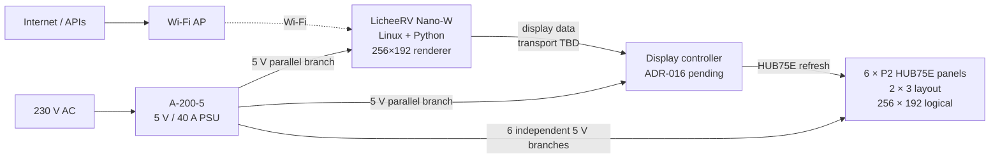
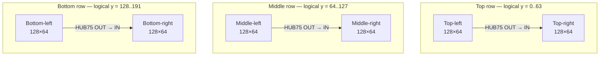
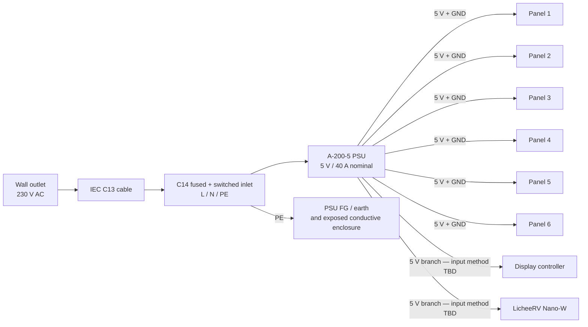
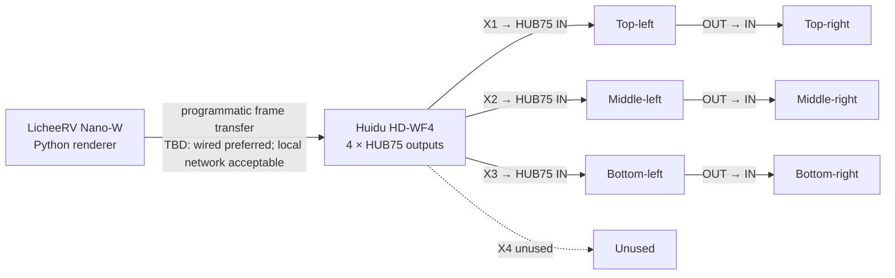
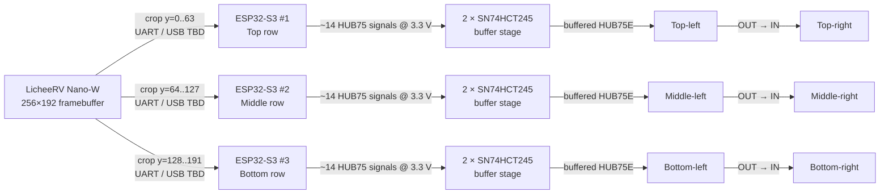
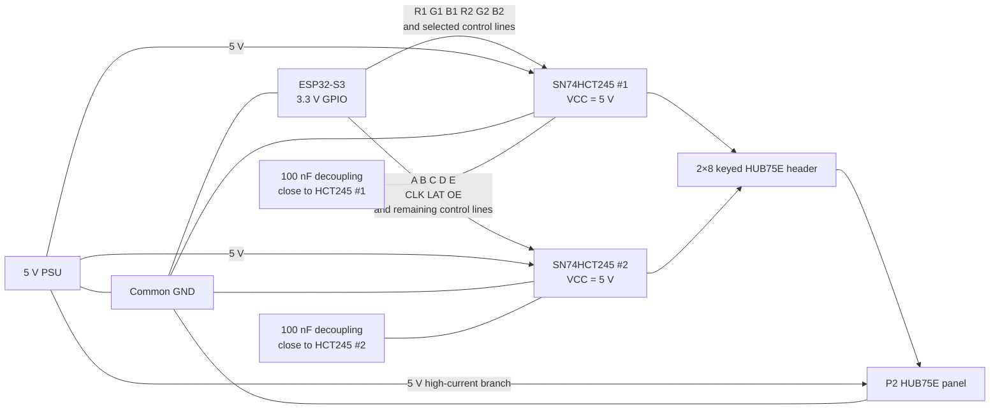
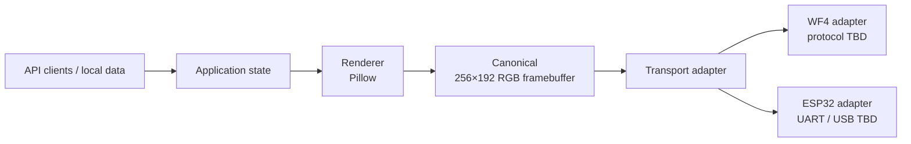
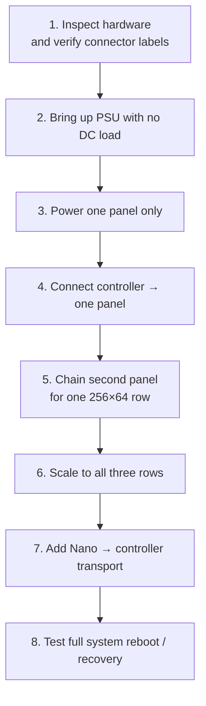

# AI Frame — Connection Diagrams

These diagrams describe the prototype's intended physical and logical connections.

They are deliberately **decision-aware**:

- **Accepted** connections reflect current architecture decisions.
- **Candidate** connections are under evaluation and must not be treated as final wiring.
- **TBD / verify on receipt** means the exact connector, pinout, voltage input, or transport still needs physical validation.

Do not infer exact board pin numbers from these diagrams. Board-specific pin mappings belong in separate schematics after hardware identification.

---

## 1. Whole-System Topology

**Status:** architecture accepted except final controller and Nano→controller transport.

---

## 2. Physical Panel Layout and HUB75 Signal Chaining

The six modules form three independent 256×64 signal rows. Within each row, HUB75 signals may chain from the left panel's `OUT` connector to the right panel's `IN` connector.

**Accepted rule:** signal chaining is allowed. Power chaining is not.

---

## 3. Power Distribution

Each panel receives its own 5 V branch. No panel carries downstream panel current.

### Power rules

- Panels are powered in parallel.
- Do not route total display current through a controller board, development board, breadboard, Dupont lead, or panel PCB trace.
- Controller and Nano power input details must be verified against the delivered boards before wiring.
- All low-voltage subsystems that exchange electrical signals must share an appropriate common ground.

---

## 4. Candidate A — Nano + HD-WF4

The WF4 is the primary stock-controller candidate because its four HUB75 outputs map naturally onto the three physical rows.

**Candidate, not final.** EXP-004 through EXP-007 determine whether this path is viable.

---

## 5. Candidate B — Nano + Three ESP32-S3 Controllers

If the ESP32 path wins, the Nano still renders one canonical 256×192 framebuffer. The transport layer crops it into three 256×64 row images.

**Candidate, not final.** EXP-010 through EXP-013 validate this path before any three-controller build.

---

## 6. ESP32 → HCT245 → HUB75 Electrical Boundary

This is a functional diagram only. Exact GPIO assignments and HCT245 pin numbers remain TBD until the actual ESP32 board is identified and measured.

### HUB75 functional signals

Expected logical signal set for the buffered path:

`R1 G1 B1 R2 G2 B2 A B C D E CLK LAT OE`

The final pin mapping must be validated against:

1. the delivered ESP32-S3 board,
2. the chosen firmware/library GPIO constraints,
3. the panel's actual HUB75E connector orientation/pinout,
4. the adapter PCB schematic.

---

## 7. Nano → Controller Transport Boundary

The application renderer must remain independent of the physical controller transport.

**Accepted software contract:** controller-specific framing, cropping, encoding, retransmission, and reconnection belong below the framebuffer boundary.

---

## 8. Bring-Up Connection Sequence

These are the connection stages implied by the current experiment plan.

Do not skip directly to full-system wiring before polarity, board revisions, connector orientation, controller power input, and panel behavior have been confirmed.

---

## 9. Diagrams Still Needed After Hardware Arrival

The following should become separate board-specific schematics once the physical hardware is available:

- `nano-power-and-io.md` — exact Nano-W power input and controller-facing I/O.
- `wf4-connections.md` — WF4 power connector, output connector orientation, and tested Nano transport.
- `wf2-connections.md` — experimental/reference wiring only.
- `esp32-hub75-pinmap.md` — actual ESP32 GPIO → HCT245 → HUB75 pin mapping.
- `mains-wiring.md` — C14 inlet switch/fuse terminal identification → PSU L/N/FG, based on the received inlet.
- `panel-power-harness.md` — actual harness connector polarity and branch topology.
- custom PCB schematic under `hardware/pcb/` if ADR-016 selects the ESP32 path.

These should be created from measured hardware and photographs, not seller photos or assumed generic pinouts.
