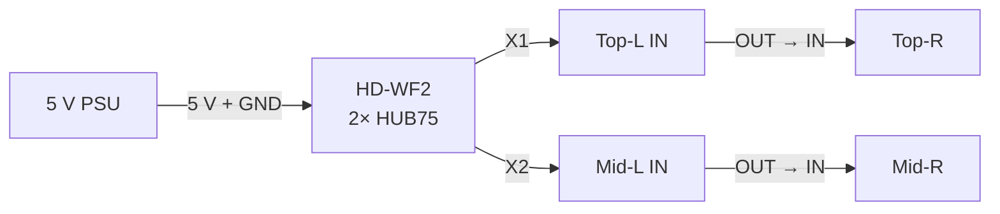

# AI Frame — Pin-Level Wiring Appendix

This file supplements `PROTOTYPE_WIRING.md` with the two areas where the first draft was still too abstract: the HD-WF2 experiment path and the physical SN74HCT245N / HUB75 pin-level wiring.

> [!WARNING]
> The HUB75 connector layout below is a **provisional reference layout** taken from a known ESP32-S3 HUB75 design. Confirm the delivered P2 panel's printed labels, keyed orientation, and continuity before soldering the adapter. The HCT245 pin numbers are manufacturer-defined and can be treated as fixed for the purchased 20-pin PDIP `SN74HCT245N` package.

---

# 1. HD-WF2 test path

WF2 is not a natural full-display solution because it has two HUB75 outputs while the display has three 256×64 rows. It is still useful for one-panel, one-row, two-row, firmware, and protocol experiments.



## WF2 connection inventory

### WF2-PWR-01 — PSU → WF2

- short red/black low-voltage power wiring
- red → PSU `+V`
- black → PSU `-V`
- exact WF2 5 V connector/termination: **VERIFY ON RECEIPT**

### WF2-SIG-01 — WF2 X1 → panel/row 1

- 1× 16-pin HUB75 IDC ribbon

### WF2-SIG-02 — first panel OUT → second panel IN

- 1× 16-pin HUB75 IDC ribbon when testing a 256×64 row

### WF2-SIG-03 — WF2 X2 → panel/row 2

- 1× 16-pin HUB75 IDC ribbon if testing both outputs

### WF2-SIG-04 — first panel OUT → second panel IN on row 2

- 1× 16-pin HUB75 IDC ribbon if testing two complete rows

Do not attempt to represent the final 2×3 display with WF2 unless testing discovers an architecture that justifies doing so.

---

# 2. SN74HCT245N physical PDIP pinout

Top view, notch at the top:

```text
                SN74HCT245N — 20-pin PDIP

                  ┌───────┐
       DIR   1  ──┤       ├── 20  VCC
       A1    2  ──┤       ├── 19  /OE
       A2    3  ──┤       ├── 18  B1
       A3    4  ──┤       ├── 17  B2
       A4    5  ──┤       ├── 16  B3
       A5    6  ──┤       ├── 15  B4
       A6    7  ──┤       ├── 14  B5
       A7    8  ──┤       ├── 13  B6
       A8    9  ──┤       ├── 12  B7
       GND  10  ──┤       ├── 11  B8
                  └───────┘
```

For our one-way level-shifting use:

```mermaid
flowchart LR
    V5[+5 V] -->|pin 20| VCC[VCC]
    V5 -->|pin 1| DIR[DIR = HIGH]
    G[GND] -->|pin 10| GG[GND]
    G -->|pin 19| OE[/OE = LOW]
    A[A1..A8\nESP32 side] --> CHIP[SN74HCT245N]
    CHIP --> B[B1..B8\nHUB75 side]
```

`DIR=HIGH` selects A→B. `/OE=LOW` enables all eight channels.

---

# 3. Exact U1 pin allocation

U1 carries the six RGB data lines plus row-address A and B.

| Function | ESP32 GPIO | U1 A input physical pin | U1 B output physical pin | Destination |
|---|---:|---:|---:|---|
| R1 | IO5 | pin 2 (`A1`) | pin 18 (`B1`) | HUB75 R1 |
| G1 | IO4 | pin 3 (`A2`) | pin 17 (`B2`) | HUB75 G1 |
| B1 | IO6 | pin 4 (`A3`) | pin 16 (`B3`) | HUB75 B1 |
| R2 | IO15 | pin 5 (`A4`) | pin 15 (`B4`) | HUB75 R2 |
| G2 | IO7 | pin 6 (`A5`) | pin 14 (`B5`) | HUB75 G2 |
| B2 | IO17 | pin 7 (`A6`) | pin 13 (`B6`) | HUB75 B2 |
| A | IO8 | pin 8 (`A7`) | pin 12 (`B7`) | HUB75 A |
| B | IO18 | pin 9 (`A8`) | pin 11 (`B8`) | HUB75 B |
| Direction | — | pin 1 | — | +5 V |
| Enable | — | pin 19 | — | GND |
| Ground | — | pin 10 | — | common GND |
| Supply | — | pin 20 | — | +5 V |

## U1 smallest physical connections

1. ESP32 IO5 → U1 pin 2
2. ESP32 IO4 → U1 pin 3
3. ESP32 IO6 → U1 pin 4
4. ESP32 IO15 → U1 pin 5
5. ESP32 IO7 → U1 pin 6
6. ESP32 IO17 → U1 pin 7
7. ESP32 IO8 → U1 pin 8
8. ESP32 IO18 → U1 pin 9
9. U1 pin 18 → HUB75 R1
10. U1 pin 17 → HUB75 G1
11. U1 pin 16 → HUB75 B1
12. U1 pin 15 → HUB75 R2
13. U1 pin 14 → HUB75 G2
14. U1 pin 13 → HUB75 B2
15. U1 pin 12 → HUB75 A
16. U1 pin 11 → HUB75 B
17. U1 pin 1 → +5 V
18. U1 pin 19 → GND
19. U1 pin 20 → +5 V
20. U1 pin 10 → GND
21. 100 nF capacitor directly between U1 pin 20 and U1 pin 10

---

# 4. Exact U2 pin allocation

U2 carries row-address C/D/E plus CLK/LAT/OE. Two channels remain unused.

| Function | ESP32 GPIO | U2 A input physical pin | U2 B output physical pin | Destination |
|---|---:|---:|---:|---|
| C | IO10 | pin 2 (`A1`) | pin 18 (`B1`) | HUB75 C |
| D | IO9 | pin 3 (`A2`) | pin 17 (`B2`) | HUB75 D |
| E | IO16 | pin 4 (`A3`) | pin 16 (`B3`) | HUB75 E |
| CLK | IO12 | pin 5 (`A4`) | pin 15 (`B4`) | HUB75 CLK |
| LAT | IO11 | pin 6 (`A5`) | pin 14 (`B5`) | HUB75 LAT |
| OE | IO13 | pin 7 (`A6`) | pin 13 (`B6`) | HUB75 OE |
| unused | — | pin 8 (`A7`) | pin 12 (`B7`) | leave unconnected |
| unused | — | pin 9 (`A8`) | pin 11 (`B8`) | leave unconnected |
| Direction | — | pin 1 | — | +5 V |
| Enable | — | pin 19 | — | GND |
| Ground | — | pin 10 | — | common GND |
| Supply | — | pin 20 | — | +5 V |

## U2 smallest physical connections

1. ESP32 IO10 → U2 pin 2
2. ESP32 IO9 → U2 pin 3
3. ESP32 IO16 → U2 pin 4
4. ESP32 IO12 → U2 pin 5
5. ESP32 IO11 → U2 pin 6
6. ESP32 IO13 → U2 pin 7
7. U2 pin 18 → HUB75 C
8. U2 pin 17 → HUB75 D
9. U2 pin 16 → HUB75 E
10. U2 pin 15 → HUB75 CLK
11. U2 pin 14 → HUB75 LAT
12. U2 pin 13 → HUB75 OE
13. U2 pin 1 → +5 V
14. U2 pin 19 → GND
15. U2 pin 20 → +5 V
16. U2 pin 10 → GND
17. 100 nF capacitor directly between U2 pin 20 and U2 pin 10
18. U2 pins 8, 9, 11, 12 → leave unconnected in the first prototype

---

# 5. Provisional 2×8 HUB75 header layout

Viewed from the mating face, this common HUB75E mapping is the reference used by the Seengreat ESP32-S3 adapter:

```text
       keyed 2×8 HUB75 connector — REFERENCE ONLY

          column 1      column 2
        ┌──────────┬──────────┐
 row 1  │ R1       │ G1       │
 row 2  │ B1       │ GND      │
 row 3  │ R2       │ G2       │
 row 4  │ B2       │ E        │
 row 5  │ A        │ B        │
 row 6  │ C        │ D        │
 row 7  │ CLK      │ LAT      │
 row 8  │ OE       │ GND      │
        └──────────┴──────────┘
```

The labels—not assumed numeric pin numbers—should drive the first perfboard build. On receipt:

1. identify the panel's `IN` versus `OUT` connector,
2. find the connector key/notch orientation,
3. compare printed signal labels if present,
4. continuity-check the two GND positions to panel ground,
5. only then assign physical header pin numbers in the KiCad schematic.

---

# 6. HCT-to-HUB75 smallest connection list

After panel orientation is verified:

- U1 pin 18 → R1
- U1 pin 17 → G1
- U1 pin 16 → B1
- U1 pin 15 → R2
- U1 pin 14 → G2
- U1 pin 13 → B2
- U1 pin 12 → A
- U1 pin 11 → B
- U2 pin 18 → C
- U2 pin 17 → D
- U2 pin 16 → E
- U2 pin 15 → CLK
- U2 pin 14 → LAT
- U2 pin 13 → OE
- common GND → both HUB75 GND positions

No +5 V power is carried through the 16-pin HUB75 signal cable in this design. Panel +5 V arrives through the separate high-current panel power harness.

---

# 7. Parts inventory for one complete ESP32 signal adapter

| Part | Quantity used | BOM status | Purpose |
|---|---:|---|---|
| ESP32-S3 N16R8 dev board | 1 | ORDERED | real-time controller |
| SN74HCT245N PDIP-20 | 2 | ORDERED | 3.3 V → 5 V logic buffering |
| 100 nF ceramic capacitor | 2 | ORDERED | local HCT decoupling |
| 1000 µF / 16 V electrolytic | 0–1 | ORDERED | optional bulk 5 V capacitance |
| 2×8 keyed 2.54 mm IDC header | 1 | ORDERED | HUB75 cable interface |
| 5×7 cm perfboard | 1 | ORDERED | first physical adapter |
| 1×40 2.54 mm header strip | as needed | ORDERED | ESP32/removable connections |
| 26 AWG Dupont/point-to-point wire | ~14 signal leads + support | ORDERED | prototype GPIO wiring |
| 5 V/GND supply conductors | 1 pair | ORDERED | adapter logic power |
| HUB75 16-pin ribbon | 1 | ORDERED | adapter → panel |

This is sufficient for **one** ESP32→HCT245→panel/row prototype adapter. It is deliberately not sufficient for the hypothetical three-ESP32 final architecture until one row has passed testing.

---

# 8. Photo-to-connection interpretation rules

The board photos now stored under `hardware/photos/` are useful for locating connectors and checking that the delivered boards resemble the ordered versions. They are not considered sufficient evidence for:

- mains terminal routing,
- connector polarity,
- exact header pin numbering,
- an unlabeled power input voltage,
- USB host/device behavior,
- GPIO availability on the generic ESP32 revision.

Those require exact documentation and/or physical measurement.
