# AI Frame — Prototype Wiring Diagrams

**Status:** experimental wiring plan, not final production schematic  
**Purpose:** break every prototype connection into the smallest practical connection units and identify the exact parts needed for each one.

> [!CAUTION]
> These diagrams are for staged prototype bring-up. Anything marked **VERIFY ON RECEIPT** must be checked against the actual delivered board revision, silkscreen, connector orientation, and continuity before power is applied. Do not infer polarity or pin numbering from a seller photograph.

## 0. Connection status legend

- **KNOWN** — supported by current project decisions and/or manufacturer documentation.
- **PROVISIONAL** — a reasonable test wiring based on reference hardware; validate before relying on it.
- **EXPERIMENTAL** — specifically intended to test an unresolved architecture question.
- **VERIFY ON RECEIPT** — exact board revision, connector orientation, or pin assignment must be physically checked first.

---

# 1. Full prototype overview

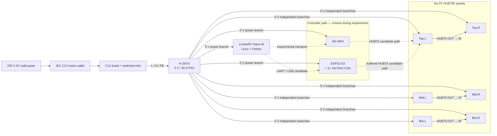

The WF4 and ESP32 are **alternative controller paths**. Do not stack them as `Nano → ESP32 → WF4 → panels`.

---

# 2. Connection inventory index

| ID | Connection | Status | Main parts |
|---|---|---|---|
| PWR-01 | Wall → C14 inlet | KNOWN | IEC C13 mains cable |
| PWR-02 | C14 inlet → PSU L/N/PE | VERIFY ON RECEIPT | 3-core 0.75 mm² cable, 6.3 mm insulated female spades, ferrules, heat-shrink |
| PWR-03 | PSU → six panels | KNOWN topology / verify polarity | 2× 1-to-4 panel harnesses |
| PWR-04 | PSU → WF4 | PROVISIONAL | 18 AWG red/black wire + suitable termination |
| PWR-05 | PSU → ESP32 test setup | PROVISIONAL | USB power during bench test or verified 5 V/VIN input |
| PWR-06 | PSU → Nano | VERIFY ON RECEIPT | preferred USB-C power path during initial bring-up |
| SIG-01 | WF4 X1 → top-left panel | EXPERIMENTAL | 16-pin HUB75 ribbon |
| SIG-02 | top-left OUT → top-right IN | KNOWN | 16-pin HUB75 ribbon |
| SIG-03 | WF4 X2 → mid-left panel | EXPERIMENTAL | 16-pin HUB75 ribbon |
| SIG-04 | mid-left OUT → mid-right IN | KNOWN | 16-pin HUB75 ribbon |
| SIG-05 | WF4 X3 → bottom-left panel | EXPERIMENTAL | 16-pin HUB75 ribbon |
| SIG-06 | bottom-left OUT → bottom-right IN | KNOWN | 16-pin HUB75 ribbon |
| DATA-01 | Nano UART TX → ESP32 RX | PROVISIONAL | Dupont jumper |
| DATA-02 | Nano UART RX ← ESP32 TX | PROVISIONAL | Dupont jumper |
| DATA-03 | Nano GND ↔ ESP32 GND | KNOWN requirement | Dupont jumper |
| BUF-01 | ESP32 GPIOs → HCT245 A-side | PROVISIONAL | Dupont wire / perfboard / headers |
| BUF-02 | HCT245 B-side → HUB75 header | PROVISIONAL | perfboard wiring + 2×8 keyed IDC header |
| BUF-03 | HCT245 VCC → 5 V | KNOWN electrical requirement | 5 V wire |
| BUF-04 | HCT245 GND → common GND | KNOWN electrical requirement | GND wire |
| BUF-05 | HCT245 DIR → HIGH | KNOWN electrical requirement | jumper to 5 V |
| BUF-06 | HCT245 /OE → LOW | KNOWN electrical requirement | jumper to GND |
| BUF-07 | 100 nF across each HCT245 VCC/GND | KNOWN | 2× 100 nF ceramic capacitors |
| DBG-01 | CH340 TX → Nano UART RX | KNOWN debug pattern | Dupont jumper |
| DBG-02 | CH340 RX ← Nano UART TX | KNOWN debug pattern | Dupont jumper |
| DBG-03 | CH340 GND ↔ Nano GND | KNOWN | Dupont jumper |

---

# 3. AC mains: wall → inlet → PSU

## 3.1 Wiring diagram

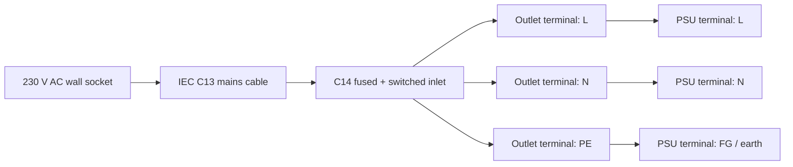

## 3.2 Smallest connection inventory

### PWR-01 — Wall → C14 inlet

- 1× normal IEC C13 mains cable
- No custom wiring

### PWR-02A — C14 `L` → PSU `L`

- 1 conductor from the 3-core 0.75 mm² mains cable
- 1× 6.3 mm insulated female spade at the inlet end **if the delivered inlet uses 6.3 mm tabs**
- 1× correctly sized bootlace ferrule at the PSU screw-terminal end
- Heat-shrink if any exposed crimp barrel remains

### PWR-02B — C14 `N` → PSU `N`

Same parts as PWR-02A.

### PWR-02C — C14 `PE` → PSU `FG / earth`

Same parts as PWR-02A. Protective earth must not be switched.

### PWR-02D — PSU `FG / earth` → conductive enclosure

**Future enclosure connection.** Add an earth bonding conductor and mechanically secure ring/spade termination when a conductive enclosure exists.

> [!DANGER]
> **VERIFY ON RECEIPT:** the purchased fused/switched C14 module's rear tab layout must be identified with its markings and continuity checked with mains disconnected. Different integrated C14/switch/fuse modules can route their switch/fuse tabs differently. Do not wire this from a generic internet diagram.

---

# 4. PSU → panel power distribution

The panel seller rating is approximately 23 W per module at 5 V, or about 4.6 A worst-case per panel. All six panels therefore require parallel power branches; panel power must never be daisy-chained through another panel.

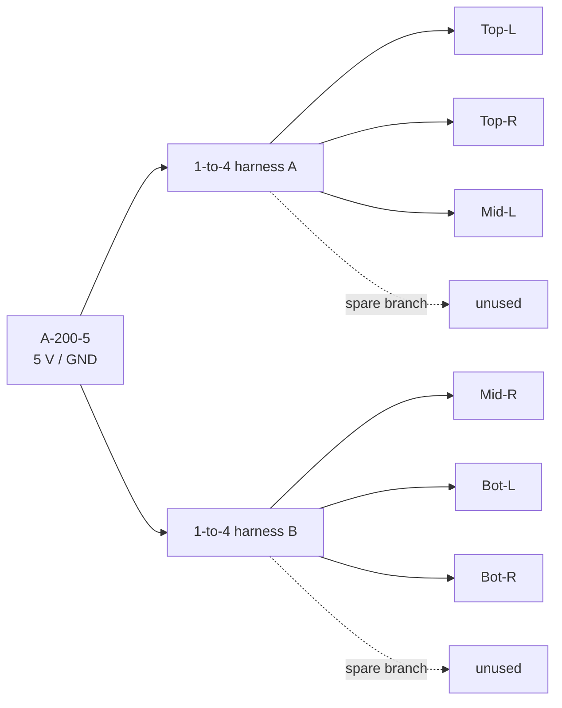

## Connection inventory

### PWR-03A — PSU → harness A input

- 1× purchased 1-to-4 LED panel power harness
- Harness input red conductor → PSU `+V`
- Harness input black conductor → PSU `-V`
- Ferrules where stranded wire enters PSU screw terminals, if compatible with the harness wire gauge

### PWR-03B — PSU → harness B input

Same as PWR-03A.

### PWR-03C through PWR-03H — harness branch → each panel

For each of six panels:

- 1× existing harness branch with panel-compatible 4-pin power plug
- Plug directly into one panel power input
- Confirm connector polarity against actual panel markings before energizing

**Do not use:** Dupont wire, breadboard, 1×40 pin header, or another panel as a power pass-through.

**VERIFY ON RECEIPT:** confirm the actual harness conductor gauge and connector fit. If a harness or its input lead becomes warm during EXP-015, replace it with heavier distribution rather than assuming the seller's “pure copper” description is sufficient.

---

# 5. WF4 controller path

The stock-controller experiment is intentionally simple: one WF4 drives three panel rows. Each output drives the first panel in one row; the second panel receives the same HUB75 stream through the first panel's OUT connector.

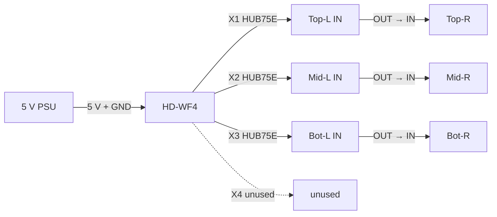

## Connection inventory

### PWR-04 — PSU → WF4

Use the WF4's **5 V standard power input** rather than trying to power the controller through a panel.

Prototype parts:

- 18 AWG red/black silicone wire, short run
- red → PSU `+V`
- black → PSU `-V`
- correct connector/termination for the delivered WF4 power socket **VERIFY ON RECEIPT**
- ferrules at PSU screw terminals where applicable

The WF4 can also accept 5 V via Micro-USB according to its documentation, but the dedicated 5 V connector is the cleaner installed path.

### SIG-01 — WF4 X1 → Top-L `IN`

- 1× 16-pin HUB75 IDC ribbon cable
- WF4 X1 keyed header → Top-L HUB75 `IN`

### SIG-02 — Top-L `OUT` → Top-R `IN`

- 1× 16-pin HUB75 IDC ribbon cable

### SIG-03 — WF4 X2 → Mid-L `IN`

- 1× 16-pin HUB75 IDC ribbon cable

### SIG-04 — Mid-L `OUT` → Mid-R `IN`

- 1× 16-pin HUB75 IDC ribbon cable

### SIG-05 — WF4 X3 → Bot-L `IN`

- 1× 16-pin HUB75 IDC ribbon cable

### SIG-06 — Bot-L `OUT` → Bot-R `IN`

- 1× 16-pin HUB75 IDC ribbon cable

This consumes exactly the six HUB75 ribbon cables currently ordered.

## Nano → WF4 data connection

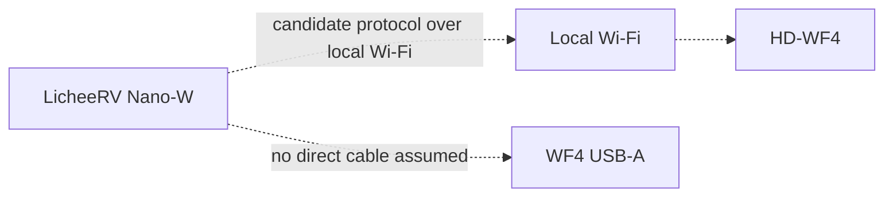

**EXPERIMENTAL / unresolved.** Huidu specifies Wi-Fi + U-disk as the normal program-update interfaces. The USB-A connector is documented for a USB flash drive; do **not** assume it is a USB device port that can simply be cabled to the Nano. EXP-007 exists to determine whether a practical Nano-controlled protocol is available.

No additional cable should be purchased for `Nano → WF4` until EXP-007 identifies the actual transport.

---

# 6. Nano → ESP32 wired data transport

For the open-controller path, start with UART because it requires only three electrical connections and is easy to probe/debug.

Sipeed documents Nano UART0 as:

- `A16` = Nano TX
- `A17` = Nano RX
- `GND` = ground

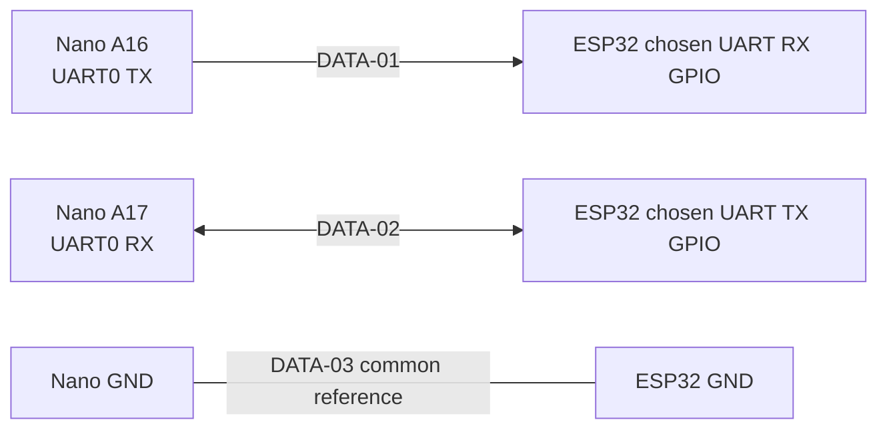

## Connection inventory

### DATA-01 — Nano TX → ESP32 RX

- 1× 26 AWG Dupont jumper
- Nano header pin `A16 (TX)` → selected ESP32 UART RX GPIO

### DATA-02 — Nano RX ← ESP32 TX

- 1× 26 AWG Dupont jumper
- Nano header pin `A17 (RX)` ← selected ESP32 UART TX GPIO

### DATA-03 — Nano GND ↔ ESP32 GND

- 1× 26 AWG Dupont jumper

### Important voltage rule

This connection is signal-only: **do not connect a 5 V TTL serial output to either board's GPIO.** The Nano↔ESP32 connection should use their native 3.3 V logic levels and a common ground.

**PROVISIONAL:** the ESP32 UART GPIO pair is not frozen yet. Choose GPIOs only after the exact generic ESP32-S3 board pin labels are confirmed and after reserving the HUB75 GPIO set.

---

# 7. ESP32 → HCT245 → HUB75 interface

This is the most detailed prototype wiring because it is the part we may eventually replace with a custom PCB.

## 7.1 Functional diagram

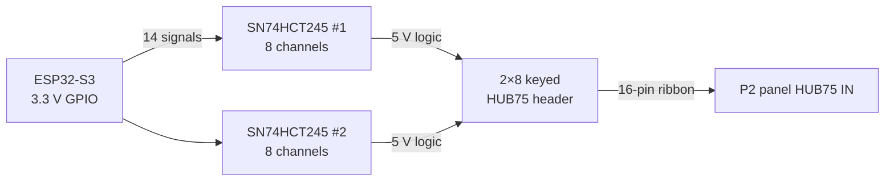

HUB75 requires these fourteen active signals:

`R1 G1 B1 R2 G2 B2 A B C D E CLK LAT OE`

The remaining two pins in the 16-pin standard interface are grounds.

## 7.2 Provisional ESP32 GPIO mapping

For first testing, use the Seengreat ESP32-S3 HUB75 reference mapping **only if the delivered generic board exposes these same IO numbers**:

| HUB75 signal | Provisional ESP32 GPIO |
|---|---:|
| R1 | IO5 |
| G1 | IO4 |
| B1 | IO6 |
| R2 | IO15 |
| G2 | IO7 |
| B2 | IO17 |
| A | IO8 |
| B | IO18 |
| C | IO10 |
| D | IO9 |
| E | IO16 |
| CLK | IO12 |
| LAT | IO11 |
| OE | IO13 |

**VERIFY ON RECEIPT:** compare the actual N16R8 dev board silkscreen and module marking before connecting anything. This is a reference mapping, not yet an AI Frame ADR.

## 7.3 HCT245 pin-level wiring

Each SN74HCT245N is a 20-pin PDIP device. For our unidirectional use:

- pin 20 `VCC` → +5 V
- pin 10 `GND` → common GND
- pin 1 `DIR` → +5 V / logic HIGH, selecting A→B direction
- pin 19 `/OE` → GND / logic LOW, permanently enabling outputs during the first prototype
- A-side pins receive ESP32 3.3 V GPIO signals
- corresponding B-side pins drive HUB75 signals

Use U1 for eight signals and U2 for the remaining six; two U2 channels remain unused.

### Suggested channel allocation

| Signal | ESP GPIO | HCT | A-side input | B-side output |
|---|---:|---|---|---|
| R1 | IO5 | U1 | A1 | B1 |
| G1 | IO4 | U1 | A2 | B2 |
| B1 | IO6 | U1 | A3 | B3 |
| R2 | IO15 | U1 | A4 | B4 |
| G2 | IO7 | U1 | A5 | B5 |
| B2 | IO17 | U1 | A6 | B6 |
| A | IO8 | U1 | A7 | B7 |
| B | IO18 | U1 | A8 | B8 |
| C | IO10 | U2 | A1 | B1 |
| D | IO9 | U2 | A2 | B2 |
| E | IO16 | U2 | A3 | B3 |
| CLK | IO12 | U2 | A4 | B4 |
| LAT | IO11 | U2 | A5 | B5 |
| OE | IO13 | U2 | A6 | B6 |
| unused | — | U2 | A7 | B7 |
| unused | — | U2 | A8 | B8 |

The logical A1→B1 etc. mapping above is deliberate; before soldering, confirm the physical DIP pin numbers against the TI package diagram.

## 7.4 Buffer-stage power and decoupling

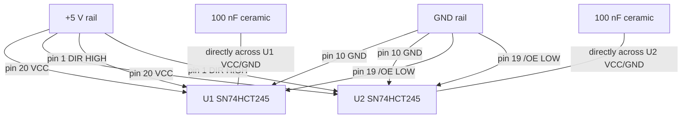

### BUF-03 / BUF-04 — HCT power

Parts:

- 5 V and GND wiring on perfboard
- optionally short lengths of 18 AWG for the board's main supply entry, then ordinary PCB/perfboard conductors for IC current

### BUF-05 — both `DIR` pins HIGH

- jumper U1 pin 1 → +5 V
- jumper U2 pin 1 → +5 V

### BUF-06 — both `/OE` pins LOW

- jumper U1 pin 19 → GND
- jumper U2 pin 19 → GND

### BUF-07 — decoupling

- 2× purchased 100 nF / `104` ceramic capacitors
- one directly between U1 pin 20 and pin 10
- one directly between U2 pin 20 and pin 10
- physically place each capacitor close to its IC rather than at the far end of the perfboard

### Optional bulk capacitance

- 1× purchased 1000 µF / 16 V electrolytic
- install across 5 V and GND near the adapter/panel interface only if useful during testing
- observe electrolytic polarity

---

# 8. HCT245 → keyed HUB75 connector

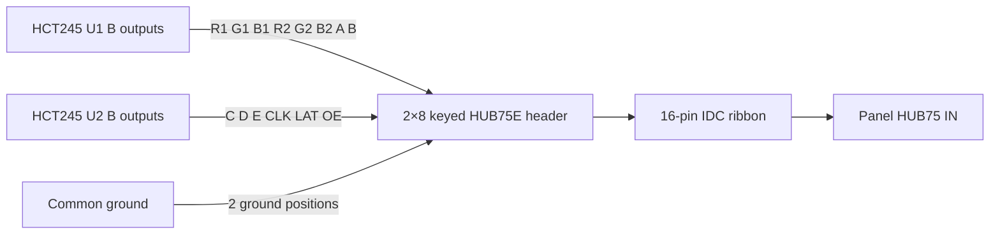

## Connection inventory

### BUF-02A — U1 B outputs → HUB75 header

- point-to-point perfboard wire for 8 signals
- 1× purchased 2×8 2.54 mm keyed IDC box header shared with BUF-02B

### BUF-02B — U2 B outputs → HUB75 header

- point-to-point perfboard wire for 6 signals

### BUF-02C — GND → HUB75 header ground pins

- two ground connections from the common ground plane/rail to the two HUB75 ground positions

### BUF-02D — header → panel

- 1× 16-pin HUB75 IDC ribbon cable

> [!WARNING]
> **VERIFY ON RECEIPT:** confirm the actual panel's HUB75E IN connector orientation and pin-1/key relationship before wiring the perfboard header. A keyed cable prevents reversal only after the board-side header has itself been wired correctly.

---

# 9. ESP32 row-controller topology if three ESP32s are eventually selected

Do not buy two additional ESP32s until one complete row passes EXP-011 and EXP-012.

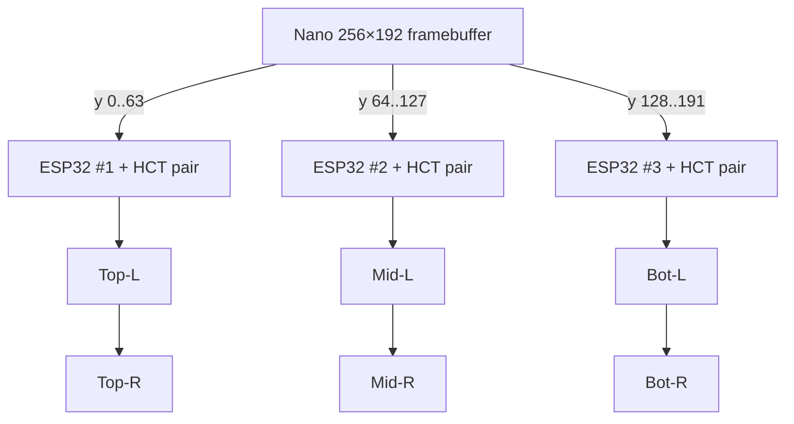

A final three-controller system would require, per row:

- 1× ESP32-S3 N16R8
- 2× SN74HCT245
- 2× 100 nF capacitor
- 1× keyed 2×8 HUB75 header
- one buffered adapter PCB/perfboard
- 2× HUB75 ribbon cables per row
- controller power branch
- Nano↔controller data connection

Therefore a full three-row ESP32 build would ultimately require **3 ESP32s, 6 HCT245s, 6 decoupling capacitors, and 3 adapter boards**. The current BOM intentionally contains only enough controller electronics to validate one row.

---

# 10. CH340 → Nano serial debugging

The CH340 is a debugging tool, not part of the installed AI Frame architecture.

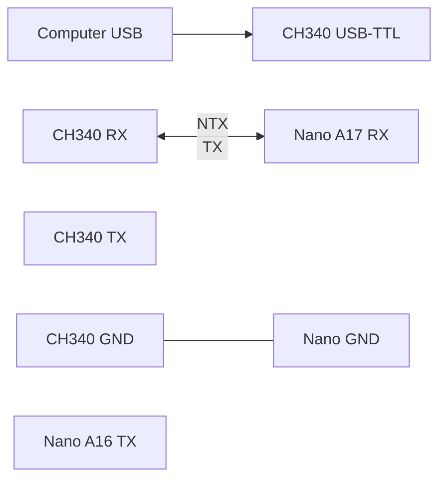

## Connection inventory

### DBG-01 — CH340 RX ← Nano TX

- 1× Dupont jumper
- CH340 `RX` ← Nano `A16 (TX)`

### DBG-02 — CH340 TX → Nano RX

- 1× Dupont jumper
- CH340 `TX` → Nano `A17 (RX)`

### DBG-03 — CH340 GND ↔ Nano GND

- 1× Dupont jumper

### Explicitly leave disconnected

- CH340 `5V` output
- CH340 `3.3V` output, unless a future isolated test explicitly calls for it

The Nano should receive power separately. The BOM already warns not to feed CH340 5 V into an independently powered target.

---

# 11. Nano power

For initial bring-up, power the Nano through its USB-C port using a known-good regulated USB 5 V source. This isolates Nano bring-up from the custom high-current display distribution and avoids guessing at a header power pin from a photo.

## PWR-06 — initial Nano power

- 1× known-good 5 V USB power source
- 1× USB cable compatible with the Nano

**Later installed power:** after the actual board and Sipeed schematic/pinout are checked, decide whether to retain USB-C power or feed a verified 5 V header/pad from the system PSU. Do not cut/splice the existing USB data cable just to create a PSU power lead.

---

# 12. Parts allocation by experiment

## EXP-002 — PSU no-load

Use:

- A-200-5 PSU
- C14 fused/switched inlet
- T2A fuse
- 3-core 0.75 mm² AC cable
- insulated 6.3 mm female spades
- ferrules + crimper
- multimeter
- heat-shrink as needed

Do not connect any controller or panel yet.

## EXP-003 — one powered panel

Add:

- 1× panel
- 1× branch of a 1-to-4 power harness

No HUB75 cable is necessary for the power-only check.

## EXP-004 — WF4 → one panel

Add:

- HD-WF4
- 1× HUB75 ribbon cable
- short 5 V/GND controller-power wiring / verified power connector

## EXP-005 — WF4 → 256×64 row

Add:

- second panel
- second HUB75 ribbon cable
- second independent panel-power branch

## EXP-006 — WF4 → six panels

Total in use:

- 1× WF4
- 6× panels
- 6× HUB75 ribbon cables
- 2× 1-to-4 panel power harnesses, six branches used
- centralized PSU

## EXP-011 — ESP32 → HCT245 → one panel

Use:

- 1× ESP32-S3 N16R8
- 2× SN74HCT245N
- 2× 100 nF capacitors
- 1× 2×8 keyed HUB75 header
- 1× 5×7 cm perfboard
- 1× HUB75 ribbon cable
- Dupont wires / 1×40 header strips as needed for removable GPIO connections
- one panel power branch
- optional 1000 µF bulk capacitor

## EXP-013 — Nano → ESP32 UART

Add:

- Nano-W
- 3× signal jumpers minimum: TX, RX, GND
- independent safe power for Nano and ESP32 during first tests

---

# 13. Parts we have versus parts not yet proven sufficient

## Already in the BOM and sufficient for the planned first-pass tests

- 6× P2 HUB75E panels
- 6× HUB75 ribbon cables
- 1× LicheeRV Nano-W
- 1× HD-WF4
- 1× HD-WF2
- 1× ESP32-S3 N16R8
- 2× SN74HCT245N
- 2× 100 nF capacitors
- 1× pack of 1000 µF capacitors
- 1× pack of keyed 2×8 HUB75 headers
- 1× pack of perfboard
- 2× 1-to-4 panel power harnesses
- 5 m 18 AWG red/black wire
- 3-core AC cable
- C14 inlet + T2A fuse
- insulated female spades
- ferrules + crimper
- 1×40 headers
- Dupont jumpers
- CH340 USB-TTL adapter
- multimeter
- soldering kit
- heat-shrink

## Items/interfaces that still need physical confirmation before we can say no extra parts are needed

1. Exact termination needed for the WF4 5 V standard power connector.
2. Whether the generic ESP32-S3 board ships with header pins soldered or requires us to solder the purchased 1×40 headers.
3. Exact Nano installed-power method after bench testing.
4. The actual panel power-harness conductor gauge and thermal performance.
5. Exact panel HUB75 connector orientation and power-connector polarity.
6. Exact C14 rear terminal routing through the integrated switch and fuse holder.
7. Whether the Nano→WF4 experiment requires any special cable at all; current evidence favors a network/protocol experiment first.
8. If three ESP32s become final: two additional ESP32 boards, four additional HCT245s, four additional 100 nF capacitors, and two additional adapter boards will be required.

---

# 14. Recommended connection order on hardware arrival

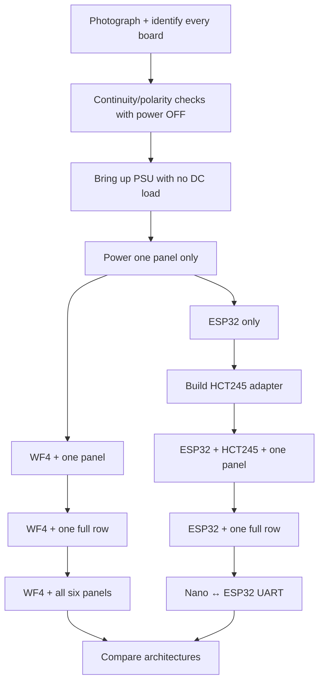

The sequence deliberately avoids connecting the entire system at once. Every new stage introduces only one new power path or signal path, making polarity errors, connector mistakes, voltage drops, and protocol failures much easier to isolate.

---

# 15. Sources and evidence hierarchy

When this file conflicts with a delivered board, **the delivered board wins** and this file must be updated.

Priority order:

1. actual delivered board markings + continuity measurements,
2. exact manufacturer schematic/manual for that revision,
3. project BOM/photos,
4. reference designs from equivalent hardware,
5. seller photographs/descriptions.

External reference points used for this draft:

- Sipeed LicheeRV Nano documentation: UART0 uses `A16 (TX)`, `A17 (RX)`, and GND; the Nano has USB2.0 OTG Type-C and 2×14 2.54 mm headers.
- Huidu HD-WF family documentation: WF4 has four HUB75 outputs; control/program updates are Wi-Fi + USB flash drive; controller supply is standard 5 V / Micro-USB.
- TI SN74HCT245 documentation: HCT is TTL-input compatible at a 4.5–5.5 V supply; DIR selects transfer direction and /OE controls the tri-state output.
- Seengreat RGB Matrix HUB75 S3 reference: provides a known ESP32-S3 GPIO mapping for the fourteen HUB75 signals used here as the provisional first-test mapping.

This is still a prototype wiring document, not a substitute for the later KiCad schematic and PCB design.